# 一 Array and String and Hash

## 1 Python string/list 操作

### 1.1. 常見錯誤

| 題目                                                         | 解答                                                         |
| ------------------------------------------------------------ | ------------------------------------------------------------ |
| 如何將一個字串的字元排序                                     | 可以直接對 str sorted,會變成sorted list ：<br/>sorted('rea') # ['a', 'e', 'r'] |
| 下面的程式碼是否正確？要如何修改？ <br>s = "1234"<br>s[4] = 'a' <br> | string不能直接指定值<br>char_list = [char for char in s]<br/>char_list[4] = 'a' |
| "/abc/aaa//c".split("/")                                     | ['', 'abc', 'aaa', '', 'c']                                  |
| a = ["abc", "aaa"] => "abc/aaa/"                             | "/".join(a) + "/"                                            |
| u"\n \t" 跟 r"\n \t" 的差別？                                | u"\n \t" => unicode編碼，代表換行跟tabe<br> r"\n \t" => "\n \t" |
| 字串或是陣列複製的時間複雜度？                               | Ｏ（n）                                                      |
| 下面程式的輸出結果是？<br> | [1, 2, 3, 4]<br/>[3, 4, 5]<br/>[3, 4]<br/>[]<br/>[]<br/>[]<br>index out of range |
| 有一個list ["a", "a", "b", "c"]，如何在指定的idx插入element "e"?如何移除chat "a"? | 1. 注意insert是inmemory修改<br>2.<br>  a.remove("a") # 使用元素移除（只會移除第一個a)<br>  del a[0] # 使用idx移除 |

### 1.2 Building Function

```

isalpha()          # 判斷是否是英文字
islower()          # 判斷是否是小寫字母
isupper()          # 判斷是否是大寫字母
istitle()          # 判斷是否是title
isnumeric()        # 判斷是否字串是否為數字(字串是否可以轉成數字)
isdigit()          # 判斷是否是數字(只對正數有效)
isalnum()       # 判斷是否是英文字母或數字

find()             # 找到某個子字傳的index，失敗會回傳nane
index()            # 找到某個子字傳的index，失敗會error

lower()            # 轉為小寫
upper()            # 轉小寫
title()            # 每個字第一個字元轉大寫

replace()          # 替換
split()            # 切分
strip()            # 移除頭尾空格
```

### 1.3 Char Order

```
ord('0') <-> chr(48)
ord('9') <-> chr(57)

ord('A') <-> chr(65)
ord('Z') <-> chr(90)

ord('a') <-> chr(97)
ord('z') <-> chr(122)
```

### 1.4 re套件

* Function

  | Funciton                                                     | Intro                                                        |
  | ------------------------------------------------------------ | ------------------------------------------------------------ |
  | re.match(pattern, string, flags)                             | 指匹配由開頭開始的（匹配一次），回傳match object             |
  | re.search(pattern, string, flags)                            | 匹配整個字符串（匹配一次），回傳match object                 |
  | 如和查看match object的結果<br>string = "hello 123abc"<br/>r = re.search("1(2)(3.*)", string) | 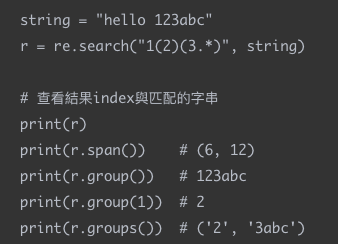 |
  | findall(pattern, string, pos, endpos)                        | 匹配所有符合規則的字符，反回符合的字串list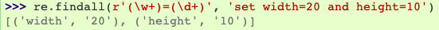 |
  | re.sub(pattern, repl, string, count = 0, flags)              | 替換並回傳替換後的字串<br>re.sub(r'123', r'321', '1234567') -> 3214567<br>可以指定fun作為替換<br>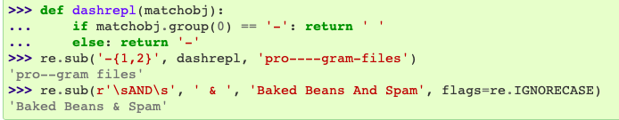 |
  | re.split(pattern, string, maxsplit, flags)                   | 切分，用（）可以保留切分的字符，回傳字串list                 |
  | re.split(r'\W*', '...words...')<br>re.split(r'(\W*)', '...words...')<br>兩者回傳結果的差別？ | 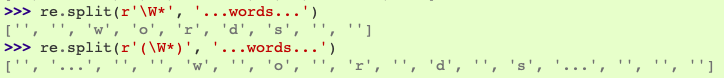 |
  | "3/2+2\*2\\2" 根據 +*\ / 切分，                              |  |

  

* Re-Regilar Expression

  | 符號  | 說明          | 符號 | 說明                                             | 符號   | 說明             |
  | ----- | ------------- | ---- | ------------------------------------------------ | ------ | ---------------- |
  | .     | 任何字符      | \d   | 數字                                             | [...]  | 裡面任一個符號   |
  | *     | 出現0次或多次 | \D   | 非數字                                           | [^...] | 非裡面任一個符號 |
  | +     | 出現一次以上  | \s   | 空白字符                                         | ()     | 分組             |
  | ?     | 0次或1次      | \S   | 非空白字符                                       | ｜     | 或               |
  | {n,m} | 出現m-m次     | \w   | 大小寫英文字母、數字                             | ^      | 字符串的起點     |
  |       |               | \W   | 非大小寫英文字母、數字                           | $      | 字符串的結尾     |
  |       |               | \b   | 比對「文字/數字的邊界」，包括underscore ( _ ) 。 |        |                  |
  |       |               | \B   | 比對非「文字/數字的邊界」，包括空格及特別字元。  |        |                  |
  
  


## 2 Hash

| 題目                                 | 解答                                                         |
| ------------------------------------ | ------------------------------------------------------------ |
| hash主要的用處是？                   | 把數值先記起來，之後在search時可以減少時間複雜度             |
| hash基本的做法？時間複雜度？         | 操作avg 都是Ｏ(1)，worse O(n)<br> |
| 有降低worse case時間複雜度的方式嗎？ | 將 hash 建成 balance BST - O(logn)                           |
| set 的實作方式？時間複雜度？         | 紀錄數字時<br>1. 用一條一維的bool陣列：集合裡若有x這個元素，就讓array[x]這個位置為true<br>2. Bit Array<br>3. hash table<br/>時間複查度跟hash一樣 |


## 3 題目

### 3.1 元素有無、比較

* 善用ord()將字元轉換成編碼紀錄在對應的int bit上

| 題目                                                         | 解答                                                         |
| ------------------------------------------------------------ | ------------------------------------------------------------ |
| 如何紀錄不同的元素是否存在？                                 | 1. Array/hash <br>2. Int (bit manupulation)，只要紀錄兩種情況（ex ａ每個元素有無) |
| Is Unique<br>Implement an algorithm to determine if a string has all unique characters. What if you cannot use additional data structures? | 1. sort<br/>2 hash / array 紀錄之前看到過的字元<br/>3.**用int作為array紀錄** |
| Check Permutation<br/>Given two strings,write a method to decide if one is a permutation of the other. | 1. 排序要個字串並比較<br/>2. 用hash/array分別紀錄兩個字串出現過的字元，在比較是否相同<br/>3. 用一個array紀錄一個加一個減最後確認是否全為零 |
| **Palindrome Permutation**<br>Given a string, write a function to check if it is a permutation of a palin­drome. A palindrome is a word or phrase that is the same forwards and backwards. A permutation is a rearrangement of letters. The palindrome does not need to be limited to just dictionary words. | 1. 用hash/array記錄每個字元出現的次數，如果都是偶數或只有一個奇數，代表是Palindrome Permutation <br/>2. 使用bit紀錄，某個字元是是奇數的時候為1，某個字元是是偶數的時候為0，最後確認為1的bit是否<=1<br>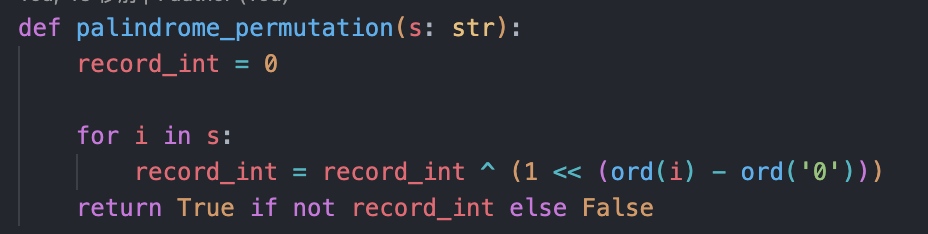 |


### 3.2 palindrome 

* 找到一個字串中最長的 palindrome 

  ```
  def longestPalindrome(self, input_string: str) -> str:
      # 1. 用特數字元插在中間，不用判斷奇數或偶數長度的回文
      input_string = "%"+"%".join([i for i in input_string]) +"%"
      # 計算最長的回文
      longest_palindrome = ""
      max_len = 0  # 計算長度時 回文的半徑 = 回文長度(沒有插入特殊符號前的)
      for i,c in enumerate(input_string):
          # 以每一個字作為回文的中心判斷是否有回文
      	  win_size = 0
      	  while i-win_size >= 0 and i+win_size < len(input_string):
      		    if input_string[i-win_size] != input_string[i+win_size]:
      			      break
      		    win_size+=1
      	  win_size-=1 # !! 因為前面是 先加在判斷 這裡要對win_size-1
          
          # 判斷是否要更新
      	  if max_len < win_size:
        	    max_len = win_size
        	    longest_palindrome = input_string[i-win_size:i+win_size+1]
  
      return longest_palindrome.replace("%","")
  ```


### 3.3 cumulative sum

| 問題                                                         | 描述                                                         | 解法                                                         |
| ------------------------------------------------------------ | ------------------------------------------------------------ | ------------------------------------------------------------ |
| **303. Range Sum Query - Immutable **                        | Given nums = [-2, 0, 3, -5, 2, -1]<br>sumRange(0, 2) -> 1<br/>sumRange(2, 5) -> -1 <br/>sumRange(0, 5) -> -3 | cumulative sum 1D，建立一個累計和的數列<br>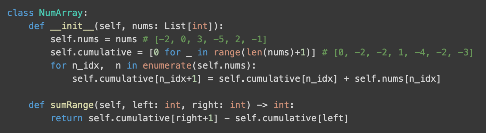 |
| **Range Sum Query 2D — Immutable **                          | Given matrix = [  [3, 0, 1, 4, 2],   [5, 6, 3, 2, 1],   [1, 2, 0, 1, 5],   [4, 1, 0, 1, 7],   [1, 0, 3, 0, 5] ]<br/>sumRegion(2, 1, 4, 3) -> 8 <br/>sumRegion(1, 1, 2, 2) -> 11 <br/>sumRegion(1, 2, 2, 4) -> 12 | cumulative sum 2D，每一列建立一個累計和的數列。              |
| [**307. Range Sum Query 1D — Mutable **](https://www.cnblogs.com/grandyang/p/4985506.html) | 同 Range Sum Query 1D — Immutable，array可能改變             | 1. 每次更新的時候重新計算累計和<br>2. 把一個 Array 分成幾個段落，cache memory 存的就是每個段落的總和，要更新的時候只要更新該斷落的累計和。<br>3. segment Tree <br>4. Binary Indexed Tree (Fenwick) |
| [**Range Sum Query 2D — Mutable **](https://www.cnblogs.com/grandyang/p/5300458.html) | 同 Range Sum Query 2D — Immutable，array可能改變             | 1. 對 Row 或者 Col 做累加，求區間總和的時候就算出每個其中的 Row /Col 的區間總和再全部加起來<br/>2. segment Tree<br/>3. Binary Indexed Tree |
| 238. Product of Array Except Self                            | 給予一個nums array 返回個數除了本身以外的積 <br>input: [1,2,3,4] output: [24,12,8,6] <br>不可以用除法 | 每一個輸入數的積會是其前面數列的積乘上後面數列的積，分別由組數的兩端遍歷找到 cumulate product sum<br> |


| 問題                                                         | 答案                                                         |
| ------------------------------------------------------------ | ------------------------------------------------------------ |
| [**307. Range Sum Query 1D — Mutable **](https://www.cnblogs.com/grandyang/p/4985506.html)<br>使用binary index tree |  |


### 3.4 string / array

| 問題                   | 描述                                                         | 解法                                                         |
| ---------------------- | ------------------------------------------------------------ | ------------------------------------------------------------ |
| URLify                 | Write a method to replace all spaces in a string with '%20'. You may assume that the string has sufficient space at the end to hold the additional characters,and that you are given the "true" length of the string. (Note: If implementing in Java,please use a character array so that you can perform this operation in place.)<br>Input: "Mr John Smith", 13 Output: Mr%20John%20Smith | 先把最後一字元由個開始拷貝到字串最後，遇到空格則轉成%20，最後再將字串往前移 |
| **String Compression** | Implement a method to perform basic string compression using the counts of repeated characters. For example, the string aabcccccaaa would become a2bc5a3. <br>Input: chars = ["a","a","b","b","c","c","c"] <br>Output:  ["a","2","b","2","c","3"] | 計算每個字元出現的次數，如果數量大於1，則替換原本的字串為數字<br>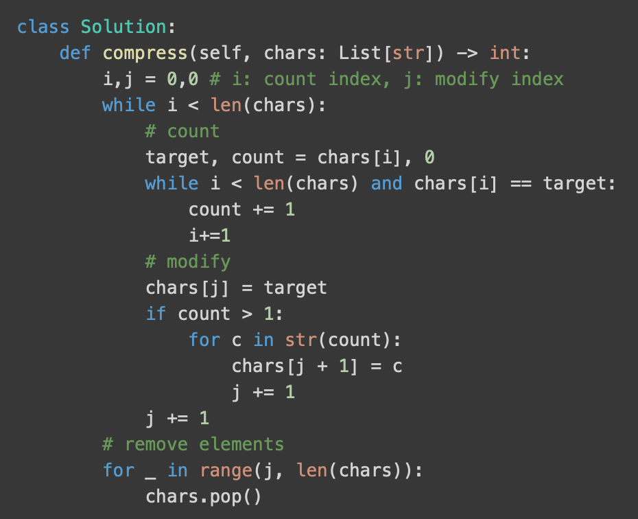 |

* 比較/旋轉 等等

  | 問題                              | 描述                                                         | 解法                                                         |
  | --------------------------------- | ------------------------------------------------------------ | ------------------------------------------------------------ |
  | **One Away**                      | There are three types of edits that can be performed on strings: insert a character, remove a character, or replace a character. Given two strings, write a function to check if they are one edit (or zero edits) away. | 1. Basic : [Edit Distance using Dynamic programming](https://www.geeksforgeeks.org/dynamic-programming-set-5-edit-distance/)，O(n^2) time<br>2. 用兩的point分別開始確兩個string，只能有一次不一樣(比對自傳長度判斷是修改、刪除、新增)，O(n) time、O(1)space |
  | Rotate Matrix<br>48. Rotate Image | You are given an `n x n` 2D `matrix` representing an image, rotate the image by **90** degrees (clockwise).You have to rotate the image [**in-place**](https://en.wikipedia.org/wiki/In-place_algorithm). | 1. 由對角線翻轉，再由x軸翻轉 <br>2. 繼算index轉換的規律，(i, j) <- (n-1-j, i) <- (n-1-i, n-1-j) <- (j, n-1-i)<br>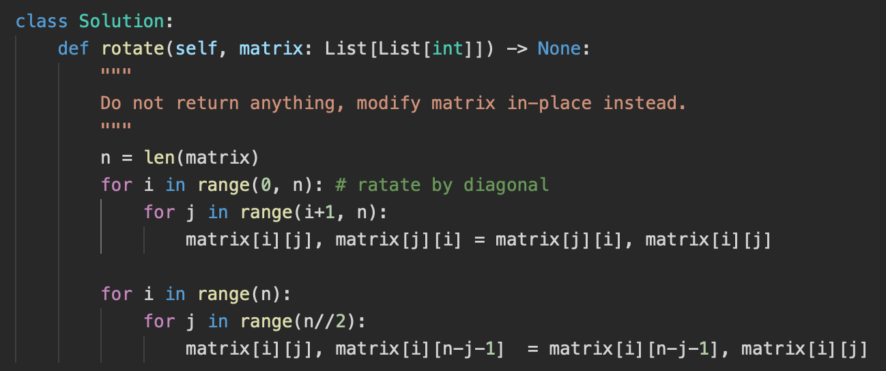 |
  | **String Rotation**               | Assume you have a method isSubstringwhich checks if one word is a substring of another. Given two strings, sl and s2, write code to check if s2 is a rotation of s1 using only one call to isSubstring (e.g.,"waterbottle" is a rotation of"erbottlewat"). | 如果s1是s2的rotation，可以把s1=xy、s2=yx。把s2 double一下，那s2=yxyx，如果s2是s1 rotation的話，則s1一定會是s2的substring |

* 找到遺失的/重複的數字

  | 問題                           | 描述                                                         | 解法                                                         |
  | ------------------------------ | ------------------------------------------------------------ | ------------------------------------------------------------ |
  | 41. First Missing Positive     | Given an unsorted integer array `nums`, return the smallest missing positive integer.<br>limit: 時間複雜度 Ｏ(N) 空間複雜度 Ｏ(1) | 1. sort在比較，但時間複雜度會是Ｏ(nlogn)<br>2.把值加入到hash中再由1開始判斷每個數字是否在hash中<br>3. 對比值跟其index,迴圈將錯誤位子的值放到正卻的位子 |
  | 268 Missig Number              | Given an array nums containing n distinct numbers in the range [0, n], return the only number in the range that is missing from the array. | 1. 排序在遍歷<br>2. 算出0-n的總和在撿到array的sum<br>3. 設一個mask = 0跟array每個值or 在跟[1-n] or |
  | 287. Find the Duplicate Number | Give a array og intergers, has n+1 items, and each val in between 1~n, There is only on repeated number, please find out the number<br/> 限制 : 不可以改變輸入的組數，也只能用 constant extra space (不可以用sort) | solution 1: 鴿籠原理 + binary search O(nlogn)<br/>solution 2: Bit Manipulation<br/>solution 3: fast/low point (不是常數的空間)<br/>solution 4: sort and find repeat (會改變nums) |
  | 17.10 Majority Element         | **17.10 Majority Element**: A majority element is an element that makes up more than half of the items in an array. Given a positive integers array, find the majority element. If there is no majority element, return-1. Do this inO(N) time and 0(1) space.<br/>Input: 1 2 5 9 5 9 5 5 5 <br/>Output: 5 | 1. 統計每個bit出現的次數，如果該bit出現的數量多於一半，代表major value該bit是1, Time O(n*bit of integer), Space O(1)<br/>2. 使用hash, Time O(n), Space O(n)<br/>3. Two loop, Time O(n^2), Space O(1)<br/>4. 把數值見到ＢＳＴ中，並計算node的數量，如果大於一半則找到major value Time O(nlogn), Space O(n)<br/>5. [Moore’s Voting Algorithm](https://www.geeksforgeeks.org/boyer-moore-majority-voting-algorithm/)<br/>因為有一半以上的數字相同，所以至少會有2個major value相鄰，因此每次選一個數做為candidate，並計算出現的數量，如果出現的數量小於0則替換candicate，最後再檢查一次candicate是否是答案 |

* 比大小/排序

  | 問題                                             | 描述                                                         | 解法                                                         |
  | ------------------------------------------------ | ------------------------------------------------------------ | ------------------------------------------------------------ |
  | **378. Kth Smallest Element in a Sorted Matrix** | Given an `n x n` `matrix` where each of the rows and columns is sorted in ascending order, return *the* `kth` *smallest element in the matrix*.<br>Input: matrix = [[1,5,9],[10,11,13],[12,13,15]], k = 8 <br>Output: 13 | 1. 把數值放到同一個數列中，排序後找<br>2. max heap，把數值都放入heap中，在找第k個大的數值<br> build heap: avg O(n), worse O(nlogn)<br> pop element: k*log(n)<br>3. 在陣列的最大值和最小直間做Binary Search，每次判斷陣列中小於mid的元素數量（由左下或右上開始找小於等於k的值）時間O(nlogX) X -> 最大最小值的差 |
  | 315. Count of Smaller Numbers After Self         | 計算給定array中每一個數字的右邊有幾個小於自己的數<br>Input: nums = [5,2,6,1] Output: [2,1,1,0] | 1. 用binary search 把數值由右往左插入新的array中，在新array中的index就是答案<br>2. 建立一個binary search tree，每個node多一個smaller參數紀錄小於自己的數有多少個，在插入節點時更新路徑上節點的smaller |
  | 406. Queue Reconstruction by Height              | 給予一個people list，每一個people[i] = [h, k]，h代表該people的身高，k代表在正確的隊列中前面有幾個人比他高，將被打亂的list重建<br>Input: people = [[7,0],[4,4],[7,1],[5,0],[6,1],[5,2]] <br>Output: [[5,0],[7,0],[5,2],[6,1],[4,4],[7,1]] | 對list排序，依h高到低排序，如果身高一樣的話在根據k小到大排序：[[7,0], [7,1], [6,1], [5,0], [5,2], [4,4]]<br>根據k將值依序插入一個新的隊列中，或是將沒排好的people往前移動 |

  

### 3.5 N-sum

* 使用hash跟two point

| 問題                                    | 描述                                                         | 解法                                                         |
| --------------------------------------- | ------------------------------------------------------------ | ------------------------------------------------------------ |
| 1. Two Sum                              | Given nums = [2, 7, 11, 15], target = 9, return [0, 1].      | 暴力解需要O(n**2)，使用hash紀錄nums的數值跟index，在遍歷看差值是否在hash中，減少查詢的時間複雜度O(n) |
| 167. Two Sum II - Input array is sorted | Given an array of integers that is already sorted in ascending order, find two numbers such that they add up to a specific target number.<br>Input: numbers = [2,7,11,15], target = 9<br/>Output: [1,2] | 因為已經排序過，用two point指向陣列頭尾(hight and low pointer)，如果和大於target，則把hight pointer往左移，小於target則把low pointer往右移 |
| 15. 3Sum                                | Given an integer array nums, return all the triplets `[nums[i], nums[j], nums[k]]` such that `i != j`, `i != k`, and `j != k`, and `nums[i] + nums[j] + nums[k] == 0`. <br>Input: nums = [-1,0,1,2,-1,-4] Output: [[-1,-1,2],[-1,0,1]] | 1. 兩個迴圈找到 two sum的結果，在用dict確認差值是否存在，Time O(n^2) Space O(n)<br>2. 對數列排序，使用一層回缺固定為數列中的一個數字，在用two point看剩下的數列和是否可以是差值Time O(n^2) Space O(1) |
| 18. 4Sum                                | Given an array `nums` of `n` integers, return *an array of all the **unique** quadruplets* `[nums[a], nums[b], nums[c], nums[d]]` such that `nums[a] + nums[b] + nums[c] + nums[d] == target`<br>Input: nums = [1,0,-1,0,-2,2], target = 0 <br>Output: [[-2,-1,1,2],[-2,0,0,2],[-1,0,0,1]] | 1. 排序後，先用雙層回圈固定前兩個直，在用two pointer找差值是否在陣列中<br>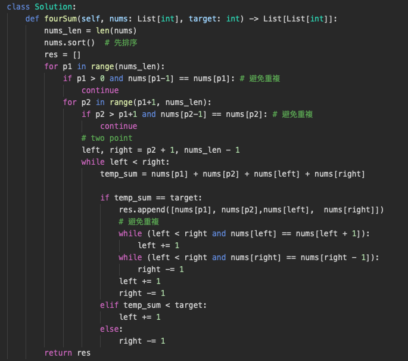 |
| 454. 4Sum II                            | Input: nums1 = [1,2], nums2 = [-2,-1], nums3 = [-1,2], nums4 = [0,2] <br>Output: 2 <br>Explanation: <br>1. nums1[0] + nums2[0] + nums3[0] + nums4[1] = 1 + (-2) + (-1) + 2 = 0 <br>2.  nums1[1] + nums2[1] + nums3[0] + nums4[0] = 2 + (-1) + (-1) + 0 = 0 | 1. 將數列1,2全部可能的和存入dictionary中，再分別確認3,4可能的和的差值是否在dictionary中，Time O(n\*\*2) |

### 3.6 Other

| 問題                          | 描述                                                         | 解法                                                         |
| ----------------------------- | ------------------------------------------------------------ | ------------------------------------------------------------ |
| 11. Container With Most Water | 給予不同高度牆壁的array求任兩個牆可以收集到最多的水量<br>Input: [1,8,6,2,5,4,8,3,7]  Output: 49<br>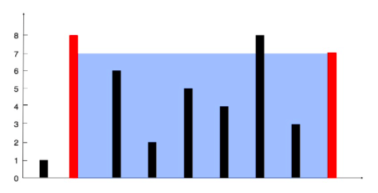 | Greedy, Two Point<br>使用left, right兩個pointer指向陣列兩端，每次移動較短的pointer<br>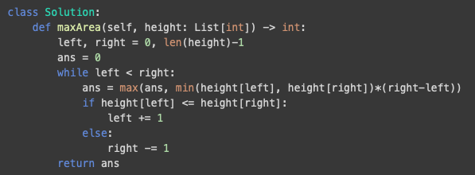<br>跟 42. Trapping Rain Water 相識，但42需要考慮中間的每一到牆，所以需要用的monotonic stack<br>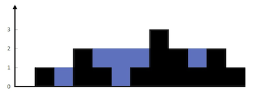 |
| 348. Design Tic-Tac-Toe       | 設計佔格子連線的遊戲，是否可以在Ｏ(1)的時間內判斷是否有ｇ輸贏 | 計算每行每列以及對角線上雙方的棋子數，數量等於邊長實代表該方勝利 |


### 3.7 Schedual

| 問題                               | 描述                                                         | 解法                                                         |
| ---------------------------------- | ------------------------------------------------------------ | ------------------------------------------------------------ |
| 單機排程，完成工作最多，總工時最少 | 有一位上班族(單機)，有N份工作。已知每份工作各要花掉多少時間，可是每份工作都有不同的完工期限，這造成有些工作可能會來不及完成。一次只處理一份工作，一份一份接著做；來不及完成的工作，乾脆放棄不做。請找出一種排程，讓如期完成的工作最多（也就是讓逾期完成的工作最少），順便讓總工時越短越好。 | 所有工作依照期限排序，依序加入排程。一次加入一個工作，一旦發現逾期，立即從排程當中抽掉工時最長的工作 |
| 單機排程，逾期時間最短             | 有一位上班族(單機)，有N份工作: <br>1. 每份工作都需要完成<br>2. 每份工作都有優先順序機制。有必須更早完成的工作、也有必須更晚完成的工作。形成一張有向無環圖。<br>3. 每份工作都有誤點賠償機制。完工時間越晚、賠償金額越大。形成N個遞增函數。 |                                                              |
|                                    | 兩臺機器，N份工作，一臺機器一次只能處理一個工作。每份工作必須先經過初號機處理一段時間，再經過貳號機處理一段時間，才算處理完畢。 |                                                              |