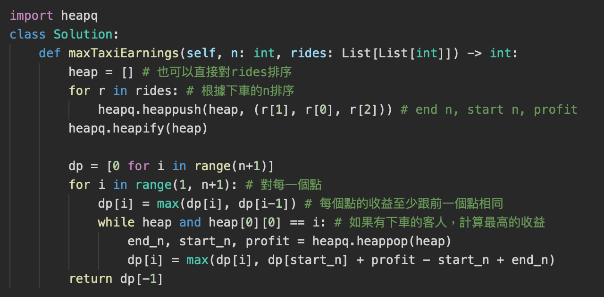
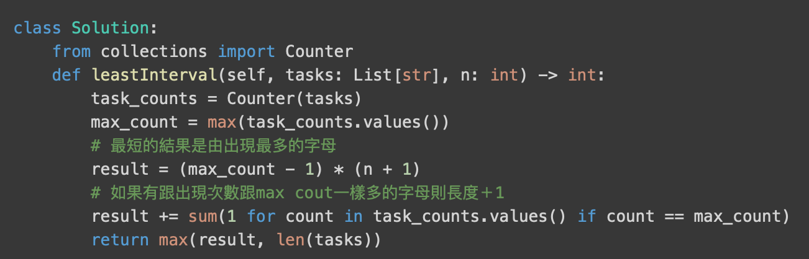
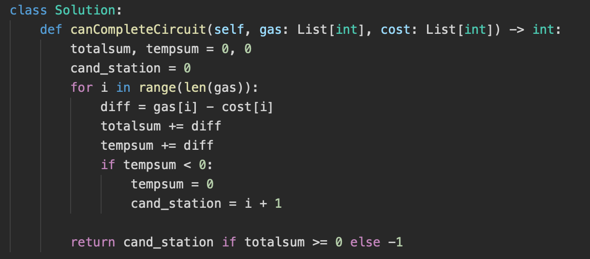

# 一 Array and String and Hash

## 1 Python string/list 操作

### 1.1. 常見錯誤

| 題目                                                         | 解答                                                         |
| ------------------------------------------------------------ | ------------------------------------------------------------ |
| 如何將一個字串的字元排序                                     | 可以直接對 str sorted,會變成sorted list ：<br/>sorted('rea') # ['a', 'e', 'r'] |
| 下面的程式碼是否正確？要如何修改？ <br>s = "1234"<br>s[4] = 'a' <br> | string不能直接指定值<br>char_list = [char for char in s]<br/>char_list[4] = 'a' |
| "/abc/aaa//c".split("/")                                     | ['', 'abc', 'aaa', '', 'c']                                  |
| a = ["abc", "aaa"] => "abc/aaa/"                             | "/".join(a) + "/"                                            |
| u"\n \t" 跟 r"\n \t" 的差別？                                | u"\n \t" => unicode編碼，代表換行跟tabe<br> r"\n \t" => "\n \t" |
| 字串或是陣列複製的時間複雜度？                               | Ｏ（n）                                                      |
| 下面程式的輸出結果是？<br> | [1, 2, 3, 4]<br/>[3, 4, 5]<br/>[3, 4]<br/>[]<br/>[]<br/>[]<br>index out of range |
| 有一個list ["a", "a", "b", "c"]，如何在指定的idx插入element "e"?如何移除chat "a"? | 1. 注意insert是inmemory修改<br>2.<br>  a.remove("a") # 使用元素移除（只會移除第一個a)<br>  del a[0] # 使用idx移除 |

### 1.2 Building Function

```

isalpha()          # 判斷是否是英文字
islower()          # 判斷是否是小寫字母
isupper()          # 判斷是否是大寫字母
istitle()          # 判斷是否是title
isdecimal()        # 判斷是否為十進制數字符，包括 Unicode、半型全型數字，不包括羅馬數字、漢字數字、小數。
isdigit()          # 判斷是否為數字字符，包括Unicode數字、半型全型數字，不包括漢字數字，羅馬數字、小數。
isnumeric()        # 判斷是否所有字符均為數值字符，包括Unicode數字、雙字節全角數字、羅馬數字、漢字數字，不包括小數。
isalnum()          # 判斷是否是英文字母或數字

find()             # 找到某個子字傳的index，失敗會回傳nane
index()            # 找到某個子字傳的index，失敗會error

lower()            # 轉為小寫
upper()            # 轉小寫
title()            # 每個字第一個字元轉大寫

replace()          # 替換
split()            # 切分
strip()            # 移除頭尾空格
```

#### str.isdecimal() v.s. str.isdigit() v.s. isalnum() 
```
>>> c = '\u00B2' # Superscript two
>>> c.isdecimal()
False
>>> c.isdigit()
True

>>> c = '\u00BD' # ½
>>> c.isdecimal()
False
>>> c.isdigit()
False
>>> c.isnumeric()
True
```

### 1.3 Char Order

```
ord('0') <-> chr(48)
ord('9') <-> chr(57)

ord('A') <-> chr(65)
ord('Z') <-> chr(90)

ord('a') <-> chr(97)
ord('z') <-> chr(122)
```

### 1.4 re套件

* Function

  | Funciton                                                     | Intro                                                        |
  | ------------------------------------------------------------ | ------------------------------------------------------------ |
  | re.match(pattern, string, flags)                             | 指匹配由開頭開始的（匹配一次），回傳match object             |
  | re.search(pattern, string, flags)                            | 匹配整個字符串（匹配一次），回傳match object                 |
  | 如和查看match object的結果<br>string = "hello 123abc"<br/>r = re.search("1(2)(3.*)", string) |  |
  | findall(pattern, string, pos, endpos)                        | 匹配所有符合規則的字符，反回符合的字串list |
  | re.sub(pattern, repl, string, count = 0, flags)              | 替換並回傳替換後的字串<br>re.sub(r'123', r'321', '1234567') -> 3214567<br>可以指定fun作為替換<br> |
  | re.split(pattern, string, maxsplit, flags)                   | 切分，用（）可以保留切分的字符，回傳字串list                 |
  | re.split(r'\W*', '...words...')<br>re.split(r'(\W*)', '...words...')<br>兩者回傳結果的差別？ |  |
  | "3/2+2\*2\\2" 根據 +*\ / 切分，                              |  |

  

* Re-Regilar Expression

  | 符號  | 說明          | 符號 | 說明                                             | 符號   | 說明             |
  | ----- | ------------- | ---- | ------------------------------------------------ | ------ | ---------------- |
  | .     | 任何字符      | \d   | 數字                                             | [...]  | 裡面任一個符號   |
  | *     | 出現0次或多次 | \D   | 非數字                                           | [^...] | 非裡面任一個符號 |
  | +     | 出現一次以上  | \s   | 空白字符                                         | ()     | 分組             |
  | ?     | 0次或1次      | \S   | 非空白字符                                       | ｜     | 或               |
  | {n,m} | 出現m-m次     | \w   | 大小寫英文字母、數字                             | ^      | 字符串的起點     |
  |       |               | \W   | 非大小寫英文字母、數字                           | $      | 字符串的結尾     |
  |       |               | \b   | 比對「文字/數字的邊界」，包括underscore ( _ ) 。 |        |                  |
  |       |               | \B   | 比對非「文字/數字的邊界」，包括空格及特別字元。  |        |                  |
  
  


## 2 Hash Table

| 題目                                 | 解答                                                         |
| ------------------------------------ | ------------------------------------------------------------ |
| hash table主要的用處是？                   | 把數值先記起來，之後在search時可以減少時間複雜度             |
| hash table基本的做法？時間複雜度？         | item -> hashfunction(item) -> hash code/index -> store item in hashtable[index] / key。avg 都是Ｏ(1)，worse O(n)<br> |
| hash table最常見的問題是什麼？ | 散列冲突”(hash **collisions**)，有資料hash後取mod後要放在hash table的同一格|
| 承上，要怎麼解決？ | [解答](https://charangan.medium.com/what-is-the-advantage-of-using-open-addressing-over-chaining-when-implementing-a-hash-table-2d401d5a403b)，開放尋址法（open addressing, open hashing）和鍊錶法（chaining, close hashing）。近一步可以將 chaining的 將 hash link 建成 balance BST - O(logn) 。    |
| worse case為什麼會發生？ 有降低worse case時間複雜度的方式嗎？ | 所有資料hash後的key都是同一個。chaining可以將 hash 建成 balance BST - O(logn)。 Open address 則可以改變找下一個空位子的方式 ex linear prob to double hash。|

### 2.1 dict in python
| 題目                                 | 解答                                                         |
| ------------------------------------ | ------------------------------------------------------------ |
| python dict 的實作方式是？ 為什麼Python 3.6以後字典有序且效率更高？ |  [答案](https://www.kingname.info/2019/07/13/python-dict/)  |
| python 怎麼計算hash ？ 每次hash的結果都一樣嗎 ？ | [答案](https://www.kingname.info/2019/07/13/python-dict/)  |
| python dict 3種遍歷方式？ 為什麼 3.6 版本後速度變快 | [答案](https://www.kingname.info/2019/07/13/python-dict/)  |

### 2.2 Set in python 

| 題目                                 | 解答                                                         |
| ------------------------------------ | ------------------------------------------------------------ |
| set 的實作方式？時間複雜度？         | 跟dict類似 不需要紀錄value |
| set 的超作方式？ 新增, 刪除, 查詢, 修改 跟 遍歷？         | [解答](https://blog.csdn.net/sinat_32872729/article/details/104926684#set_267)) |


## 3 題目

### 3.1 元素有無、比較

* 善用ord()將字元轉換成編碼紀錄在對應的int bit上

| 題目                                                         | 解答                                                         |
| ------------------------------------------------------------ | ------------------------------------------------------------ |
| 如何紀錄不同的元素是否存在？                                 | 1. Array/hash <br>2. Int (bit manupulation)，只要紀錄兩種情況（ex ａ每個元素有無) |
| Is Unique<br>Implement an algorithm to determine if a string has all unique characters. What if you cannot use additional data structures? | 1. sort<br/>2 hash / array 紀錄之前看到過的字元<br/>3.**用int作為array紀錄** |
| Check Permutation<br/>Given two strings,write a method to decide if one is a permutation of the other. | 1. 排序要個字串並比較<br/>2. 用hash/array分別紀錄兩個字串出現過的字元，在比較是否相同<br/>3. 用一個array紀錄一個加一個減最後確認是否全為零 |
| **Palindrome Permutation**<br>Given a string, write a function to check if it is a permutation of a palin­drome. A palindrome is a word or phrase that is the same forwards and backwards. A permutation is a rearrangement of letters. The palindrome does not need to be limited to just dictionary words. | 1. 用hash/array記錄每個字元出現的次數，如果都是偶數或只有一個奇數，代表是Palindrome Permutation <br/>2. 使用bit紀錄，某個字元是是奇數的時候為1，某個字元是是偶數的時候為0，最後確認為1的bit是否<=1<br> |


### 3.2 palindrome 

* 找到一個字串中最長的 palindrome 

  ```
  def longestPalindrome(self, input_string: str) -> str:
      # 1. 用特數字元插在中間，不用判斷奇數或偶數長度的回文
      input_string = "%"+"%".join([i for i in input_string]) +"%"
      # 計算最長的回文
      longest_palindrome = ""
      max_len = 0  # 計算長度時 回文的半徑 = 回文長度(沒有插入特殊符號前的)
      for i,c in enumerate(input_string):
          # 以每一個字作為回文的中心判斷是否有回文
      	  win_size = 0
      	  while i-win_size >= 0 and i+win_size < len(input_string):
      		    if input_string[i-win_size] != input_string[i+win_size]:
      			      break
      		    win_size+=1
      	  win_size-=1 # !! 因為前面是 先加在判斷 這裡要對win_size-1
          
          # 判斷是否要更新
      	  if max_len < win_size:
        	    max_len = win_size
        	    longest_palindrome = input_string[i-win_size:i+win_size+1]
  
      return longest_palindrome.replace("%","")
  ```


### 3.3 cumulative sum

| 問題                                                         | 描述                                                         | 解法                                                         |
| ------------------------------------------------------------ | ------------------------------------------------------------ | ------------------------------------------------------------ |
| **303. Range Sum Query - Immutable **                        | Given nums = [-2, 0, 3, -5, 2, -1]<br>sumRange(0, 2) -> 1<br/>sumRange(2, 5) -> -1 <br/>sumRange(0, 5) -> -3 | cumulative sum 1D，建立一個累計和的數列<br> |
| **Range Sum Query 2D — Immutable **                          | Given matrix = [  [3, 0, 1, 4, 2],   [5, 6, 3, 2, 1],   [1, 2, 0, 1, 5],   [4, 1, 0, 1, 7],   [1, 0, 3, 0, 5] ]<br/>sumRegion(2, 1, 4, 3) -> 8 <br/>sumRegion(1, 1, 2, 2) -> 11 <br/>sumRegion(1, 2, 2, 4) -> 12 | cumulative sum 2D，每一列建立一個累計和的數列。              |
| [**307. Range Sum Query 1D — Mutable **](https://www.cnblogs.com/grandyang/p/4985506.html) | 同 Range Sum Query 1D — Immutable，array可能改變             | 1. 每次更新的時候重新計算累計和<br>2. 把一個 Array 分成幾個段落，cache memory 存的就是每個段落的總和，要更新的時候只要更新該斷落的累計和。<br>3. segment Tree <br>4. Binary Indexed Tree (Fenwick) |
| [**Range Sum Query 2D — Mutable **](https://www.cnblogs.com/grandyang/p/5300458.html) | 同 Range Sum Query 2D — Immutable，array可能改變             | 1. 對 Row 或者 Col 做累加，求區間總和的時候就算出每個其中的 Row /Col 的區間總和再全部加起來<br/>2. segment Tree<br/>3. Binary Indexed Tree |
| 238. Product of Array Except Self                            | 給予一個nums array 返回個數除了本身以外的積 <br>input: [1,2,3,4] output: [24,12,8,6] <br>不可以用除法 | 每一個輸入數的積會是其前面數列的積乘上後面數列的積，分別由組數的兩端遍歷找到 cumulate product sum<br> |


| 問題                                                         | 答案                                                         |
| ------------------------------------------------------------ | ------------------------------------------------------------ |
| [**307. Range Sum Query 1D — Mutable **](https://www.cnblogs.com/grandyang/p/4985506.html)<br>使用binary index tree |  |


### 3.4 string / array

* 字串修改與處理

  | 問題                                                       | 描述                                                         | 解法                                                         |
  | ---------------------------------------------------------- | ------------------------------------------------------------ | ------------------------------------------------------------ |
  | URLify                                                     | Write a method to replace all spaces in a string with '%20'. You may assume that the string has sufficient space at the end to hold the additional characters,and that you are given the "true" length of the string. (Note: If implementing in Java,please use a character array so that you can perform this operation in place.)<br>Input: "Mr John Smith", 13 Output: Mr%20John%20Smith | 先把最後一字元由個開始拷貝到字串最後，遇到空格則轉成%20，最後再將字串往前移 |
  | **String Compression**<br>443. String Compression<br>      | Implement a method to perform basic string compression using the counts of repeated characters. For example, the string aabcccccaaa would become a2bc5a3. <br>Input: chars = ["a","a","b","b","c","c","c"] <br>Output:  ["a","2","b","2","c","3"] | 計算每個字元出現的次數，如果數量大於1，則替換原本的字串為數字<br> |
  | **28. Find the Index of the First Occurrence in a String** | Given two strings `needle` and `haystack`, return the index of the first occurrence of `needle` in `haystack`, or `-1` if `needle` is not part of `haystack`.<br>Input: haystack = "sadbutsad", needle = "sad" <br>Output: 0 | 1. Two point + 雙層回圈比較是否相似，Ｏ（m*n）<br>2. Knuth-Morris-Pratt (KMＰ)  O(Ｎ) TIME: 核心是在動態規劃，根據之前比較的結果，指移動後續必要的指針<br/>3. **Rolling Hash O(N)**: 把needl跟haystack要比較的字串生成hash code |

* 比較/旋轉 等等

  | 問題                              | 描述                                                         | 解法                                                         |
  | --------------------------------- | ------------------------------------------------------------ | ------------------------------------------------------------ |
  | **One Away**                      | There are three types of edits that can be performed on strings: insert a character, remove a character, or replace a character. Given two strings, write a function to check if they are one edit (or zero edits) away. | 1. Basic : [Edit Distance using Dynamic programming](https://www.geeksforgeeks.org/dynamic-programming-set-5-edit-distance/)，O(n^2) time<br>2. 用兩的point分別開始確兩個string，只能有一次不一樣(比對自傳長度判斷是修改、刪除、新增)，O(n) time、O(1)space |
  | Rotate Matrix<br>48. Rotate Image | You are given an `n x n` 2D `matrix` representing an image, rotate the image by **90** degrees (clockwise).You have to rotate the image [**in-place**](https://en.wikipedia.org/wiki/In-place_algorithm). | 1. 由對角線翻轉，再由x軸翻轉 <br>2. 繼算index轉換的規律，(i, j) <- (n-1-j, i) <- (n-1-i, n-1-j) <- (j, n-1-i)<br> |
  | **String Rotation**               | Assume you have a method isSubstringwhich checks if one word is a substring of another. Given two strings, sl and s2, write code to check if s2 is a rotation of s1 using only one call to isSubstring (e.g.,"waterbottle" is a rotation of"erbottlewat"). | 如果s1是s2的rotation，可以把s1=xy、s2=yx。把s2 double一下，那s2=yxyx，如果s2是s1 rotation的話，則s1一定會是s2的substring |
  | 151. Reverse Words in a String    | 翻轉sentence裡的word，空間複雜度Ｏ(1)<br>Input: s = "the sky is blue" Output: "blue is sky the"<br>Input: s = "  hello world  " Output: "world hello" | 整個字串翻轉一次，在個別翻轉word                             |

* 找到遺失的/重複的數字

  | 問題                                            | 描述                                                         | 解法                                                         |
  | ----------------------------------------------- | ------------------------------------------------------------ | ------------------------------------------------------------ |
  | 41. First Missing Positive                      | Given an unsorted integer array `nums`, return the smallest missing positive integer.<br>limit: 時間複雜度 Ｏ(N) 空間複雜度 Ｏ(1) | 1. sort在比較，但時間複雜度會是Ｏ(nlogn)<br>2.把值加入到hash中再由1開始判斷每個數字是否在hash中<br>3. 對比值跟其index,迴圈將錯誤位子的值放到正卻的位子 |
  | 268 Missig Number                               | Given an array nums containing n distinct numbers in the range [0, n], return the only number in the range that is missing from the array. | 1. 排序在遍歷<br>2. 算出0-n的總和在撿到array的sum<br>3. 設一個mask = 0跟array每個值or 在跟[1-n] or |
  | 287. Find the Duplicate Number                  | Give a array og intergers, has n+1 items, and each val in between 1~n, There is only on repeated number, please find out the number<br/> 限制 : 不可以改變輸入的組數，也只能用 constant extra space (不可以用sort) | solution 1: 鴿籠原理 + binary search O(nlogn)<br/>solution 2: Bit Manipulation<br/>solution 3: fast/low point (不是常數的空間)<br/>solution 4: sort and find repeat (會改變nums) |
  | 17.10 Majority Element<br>169. Majority Element | **17.10 Majority Element**: A majority element is an element that makes up more than half of the items in an array. Given a positive integers array, find the majority element. If there is no majority element, return-1. Do this inO(N) time and 0(1) space.<br/>Input: 1 2 5 9 5 9 5 5 5 <br/>Output: 5 | 1. 統計每個bit出現的次數，如果該bit出現的數量多於一半，代表major value該bit是1, Time O(n*bit of integer), Space O(1)<br/>2. 使用hash, Time O(n), Space O(n)<br/>3. Two loop, Time O(n^2), Space O(1)<br/>4. 把數值見到ＢＳＴ中，並計算node的數量，如果大於一半則找到major value Time O(nlogn), Space O(n)<br/>5. [Moore’s Voting Algorithm](https://www.geeksforgeeks.org/boyer-moore-majority-voting-algorithm/)<br/>因為有一半以上的數字相同，所以至少會有2個major value相鄰，因此每次選一個數做為candidate，並計算出現的數量，如果出現的數量小於0則替換candicate，最後再檢查一次candicate是否是答案 |

* 比大小/排序

  | 問題                                             | 描述                                                         | 解法                                                         |
  | ------------------------------------------------ | ------------------------------------------------------------ | ------------------------------------------------------------ |
  | **378. Kth Smallest Element in a Sorted Matrix** | Given an `n x n` `matrix` where each of the rows and columns is sorted in ascending order, return *the* `kth` *smallest element in the matrix*.<br>Input: matrix = [[1,5,9],[10,11,13],[12,13,15]], k = 8 <br>Output: 13 | 1. 把數值放到同一個數列中，排序後找<br>2. max heap，把數值都放入heap中，在找第k個大的數值<br> build heap: avg O(n), worse O(nlogn)<br> pop element: k*log(n)<br>3. 在陣列的最大值和最小直間做Binary Search，每次判斷陣列中小於mid的元素數量（由左下或右上開始找小於等於k的值）時間O(nlogX) X -> 最大最小值的差 |
  | 315. Count of Smaller Numbers After Self         | 計算給定array中每一個數字的右邊有幾個小於自己的數<br>Input: nums = [5,2,6,1] Output: [2,1,1,0] | 1. 用binary search 把數值由右往左插入新的array中，在新array中的index就是答案<br>2. 建立一個binary search tree，每個node多一個smaller參數紀錄小於自己的數有多少個，在插入節點時更新路徑上節點的smaller |
  | 406. Queue Reconstruction by Height              | 給予一個people list，每一個people[i] = [h, k]，h代表該people的身高，k代表在正確的隊列中前面有幾個人比他高，將被打亂的list重建<br>Input: people = [[7,0],[4,4],[7,1],[5,0],[6,1],[5,2]] <br>Output: [[5,0],[7,0],[5,2],[6,1],[4,4],[7,1]] | 對list排序，依h高到低排序，如果身高一樣的話在根據k小到大排序：[[7,0], [7,1], [6,1], [5,0], [5,2], [4,4]]<br>根據k將值依序插入一個新的隊列中，或是將沒排好的people往前移動 |


### 3.5 N-sum

* 使用hash跟two point

| 問題                                    | 描述                                                         | 解法                                                         |
| --------------------------------------- | ------------------------------------------------------------ | ------------------------------------------------------------ |
| 1. Two Sum                              | Given nums = [2, 7, 11, 15], target = 9, return [0, 1].      | 暴力解需要O(n**2)，使用hash紀錄nums的數值跟index，在遍歷看差值是否在hash中，減少查詢的時間複雜度O(n) |
| 167. Two Sum II - Input array is sorted | Given an array of integers that is already sorted in ascending order, find two numbers such that they add up to a specific target number.<br>Input: numbers = [2,7,11,15], target = 9<br/>Output: [1,2] | 因為已經排序過，用two point指向陣列頭尾(hight and low pointer)，如果和大於target，則把hight pointer往左移，小於target則把low pointer往右移 |
| 15. 3Sum                                | Given an integer array nums, return all the triplets `[nums[i], nums[j], nums[k]]` such that `i != j`, `i != k`, and `j != k`, and `nums[i] + nums[j] + nums[k] == 0`. <br>Input: nums = [-1,0,1,2,-1,-4] Output: [[-1,-1,2],[-1,0,1]] | 1. 兩個迴圈找到 two sum的結果，在用dict確認差值是否存在，Time O(n^2) Space O(n)<br>2. 對數列排序，使用一層回缺固定為數列中的一個數字，在用two point看剩下的數列和是否可以是差值Time O(n^2) Space O(1) |
| 18. 4Sum                                | Given an array `nums` of `n` integers, return *an array of all the **unique** quadruplets* `[nums[a], nums[b], nums[c], nums[d]]` such that `nums[a] + nums[b] + nums[c] + nums[d] == target`<br>Input: nums = [1,0,-1,0,-2,2], target = 0 <br>Output: [[-2,-1,1,2],[-2,0,0,2],[-1,0,0,1]] | 1. 排序後，先用雙層回圈固定前兩個直，在用two pointer找差值是否在陣列中<br> |
| 454. 4Sum II                            | Input: nums1 = [1,2], nums2 = [-2,-1], nums3 = [-1,2], nums4 = [0,2] <br>Output: 2 <br>Explanation: <br>1. nums1[0] + nums2[0] + nums3[0] + nums4[1] = 1 + (-2) + (-1) + 2 = 0 <br>2.  nums1[1] + nums2[1] + nums3[0] + nums4[0] = 2 + (-1) + (-1) + 0 = 0 | 1. 將數列1,2全部可能的和存入dictionary中，再分別確認3,4可能的和的差值是否在dictionary中，Time O(n\*\*2) |

### 3.6 Other

| 問題                          | 描述                                                         | 解法                                                         |
| ----------------------------- | ------------------------------------------------------------ | ------------------------------------------------------------ |
| 11. Container With Most Water | 給予不同高度牆壁的array求任兩個牆可以收集到最多的水量<br>Input: [1,8,6,2,5,4,8,3,7]  Output: 49<br> | Greedy, Two Point<br>使用left, right兩個pointer指向陣列兩端，每次移動較短的pointer<br><br>跟 42. Trapping Rain Water 相識，但42需要考慮中間的每一到牆，所以需要用的monotonic stack<br> |
| 348. Design Tic-Tac-Toe       | 設計佔格子連線的遊戲，是否可以在Ｏ(1)的時間內判斷是否有ｇ輸贏 | 計算每行每列以及對角線上雙方的棋子數，數量等於邊長實代表該方勝利 |


### 3.7 Schedual

| 問題                                   | 描述                                                         | 解法                                                         |
| -------------------------------------- | ------------------------------------------------------------ | ------------------------------------------------------------ |
| 單機排程，完成工作最多，總工時最少     | 有一位上班族(單機)，有N份工作。已知每份工作各要花掉多少時間，可是每份工作都有不同的完工期限，這造成有些工作可能會來不及完成。一次只處理一份工作，一份一份接著做；來不及完成的工作，乾脆放棄不做。請找出一種排程，讓如期完成的工作最多（也就是讓逾期完成的工作最少），順便讓總工時越短越好。 | 所有工作依照期限排序，依序加入排程。一次加入一個工作，一旦發現逾期，立即從排程當中抽掉工時最長的工作 |
| 單機排程，逾期時間最短                 | 有一位上班族(單機)，有N份工作: <br>1. 每份工作都需要完成<br>2. 每份工作都有優先順序機制。有必須更早完成的工作、也有必須更晚完成的工作。形成一張有向無環圖。<br>3. 每份工作都有誤點賠償機制。完工時間越晚、賠償金額越大。形成N個遞增函數。 |                                                              |
|                                        | 兩臺機器，N份工作，一臺機器一次只能處理一個工作。每份工作必須先經過初號機處理一段時間，再經過貳號機處理一段時間，才算處理完畢。 |                                                              |
| 1235. Maximum Profit in Job Scheduling |  | 1. 將job個格式整理成(s,e,p)的格式並排序，之後遍歷每個job，如果該job開始前有其他的工作已幾結束，則更新max profit，最後計算該job的maxprofit並將end time放到heap中<br>2. DP，DP[i]表示在end time i的最佳收益，遍歷每個job i，並用二分法找到end time最接近job i start time 的 job j，已更新job i 結束時的max profit |
| 2008. Maximum Earnings From Taxi       | There are `n` points on a road you are driving your taxi on. The `n` points on the road are labeled from `1` to `n` in the direction you are going, and you want to drive from point `1` to point `n` to make money by picking up passengers. You cannot change the direction of the taxi.<br>Given `n` and `rides`, return *the **maximum** number of dollars you can earn by picking up the passengers optimally.*<br>**Note:** You may drop off a passenger and pick up a different passenger at the same point. | 1. 對rides用下車的n排序，在使用dp紀錄每個n最佳的收益 |
| 2054. Two Best Non-Overlapping Events  | You are given a 0-indexed 2D integer array of events where events[i] = [startTimei, endTimei, valuei]. The ith event starts at startTimei and ends at endTimei, and if you attend this event, you will receive a value of valuei. You can choose at most two non-overlapping events to attend such that the sum of their values is maximized.<br/>Return this maximum sum.<br/>Note that the start time and end time is inclusive: that is, you cannot attend two events where one of them starts and the other ends at the same time. More specifically, if you attend an event with end time t, the next event must start at or after t + 1.<br/> | 類似1235但是只要求最多兩個區段和 |
| 621. Task Scheduler                    | Given a characters array `tasks`, representing the tasks a CPU needs to do, where each letter represents a different task. Tasks could be done in any order. Each task is done in one unit of time. For each unit of time, the CPU could complete either one task or just be idle.<br>However, there is a non-negative integer `n` that represents the cooldown period between two **same tasks** (the same letter in the array), that is that there must be at least `n` units of time between any two same tasks.<br>Return *the least number of units of times that the CPU will take to finish all the given tasks*. | 用dict統計每個不統字母的出現次數，並以完成該字母的最大自原來排定間隔，ex A A A A B B C, n=2：Ａ_ _ A _ _ A _ _ A ，並把其他字母填入_中，如果全部的字母過多\_的位子放不完，則平均安插在每個Ａ的字元間 |


### 3.8 Greedy

| 問題             | 描述                                                         | 解法                                                         |
| ---------------- | ------------------------------------------------------------ | ------------------------------------------------------------ |
| 134. Gas Station | There are `n` gas stations along a circular route, where the amount of gas at the `ith` station is `gas[i]`.<br>You have a car with an unlimited gas tank and it costs `cost[i]` of gas to travel from the `ith` station to its next `(i + 1)th` station. You begin the journey with an empty tank at one of the gas stations.<br>Given two integer arrays `gas` and `cost`, return *the starting gas station's index if you can travel around the circuit once in the clockwise direction, otherwise return* `-1`. If there exists a solution, it is **guaranteed** to be **unique**<br> | iterate over  both the gas and the cost array, and if the sum of  gas[i] - cost[i] < 0 means we need to find a new candidate station, let candi_station = i + 1, and continue to check to sum.<br>Finally,  check if sum(cost-gas) >= 0  if it is return candi_station else return -1<br> |
