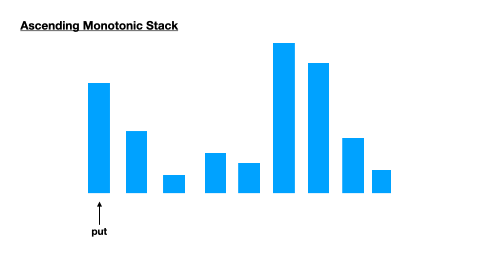
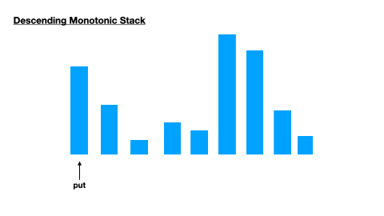

# 1.3 Stack and Queue

## Stack - First in Last out(FILO)

| Function    | Description                                   |
| ----------- | --------------------------------------------- |
| pop()       | Remove the top item from the stack            |
| push(iterm) | Add an item to the top of the stack           |
| peek()      | Return the top of the stack.                  |
| isEmpty ()  | Return true if and only if the stack is empty |

## Queue - First In First Out (FIFO)

| Function   | Description                                   |
| ---------- | --------------------------------------------- |
| remove()   | Remove the first item in the list.            |
| add(itern) | Add an item to the end of the list            |
| peek()     | Return the top of the stack.                  |
| isEmpty () | Return true if and only if the stack is empty |

### Queue in Python

| 問題                                      | 答案                                                         |
| ----------------------------------------- | ------------------------------------------------------------ |
| queue 在python中有哪3種做法               | list  collections.deque queue.Queue                    |
| 建立一個queue並放入並取出element          | form collections import deque q = deque([]) # 大部分操作跟list一樣 q.appendleft(1) q.popleft(1) |
| 建立一個priority queue並放入並取出element | 1. heapq 2.  queue.PriorityQueue` 內部也是使用 heapq  |

## 1 Ｑuestion

### 1.1 Stack : 括號 前後墜 

**計算式**

| 題目                                  | 描述                                                         | 解法                                                         |
| ------------------------------------- | ------------------------------------------------------------ | ------------------------------------------------------------ |
| Expression                            | 前中後序，怎麼轉換？                                         |  |
| 150. Evaluate Reverse Polish Notation | Input: tokens = ["2","1","+","3","*"]  Output: 9  Explanation: ((2 + 1) * 3) = 9 follow up: 前敘式？ | postorder  - 可以忽略括號，由**左而右**掃描，當是數字時入stack，符號時pop，處理完再將新的數字入stack  preorder  - 可以忽略括號，由**右而左**掃描，當是數字時入stack，符號時pop，處理完再將新的數字入stack |
| 227. Basic Calculator II              | Given a string `s` which represents an expression, *evaluate this expression and return its value*.  The integer division should truncate toward zero. " 6-4 / 2 " = 4 | 遍歷計算式，將數字放到stack中，遇到-則對數字加上負號，遇到＊/則pop出一個數字跟符號後的數字做計算，再把結果放到stack，遍歷結束代表＊/都已完成將stack內的結果sum起來就是答案(並不能處理像是 1 * -2 的算式) |
| 772. Basic Calculator III             | 比Basic Calculator II多了括號，且可能會有巢狀括號 "2*(5+5*2)/3+(6/2+8)" = 21 | 碰到括號後把括號的部份丟入遞迴計算答案 1, Time(n^2) Space(N^2) ，字串複製需要Ｏ(n)的時間 2. Time(n) Space(N^2) ，使用idx作為參數  |
| 224. Basic Calculator                 | 會出現＋-跟括號 Input: s = "(1+(4+5+2)-3)+(6+8)" Output: 23 | 1. 因為回圈只有單層，可以用stack做，res = sign*num，sign可以為＋- 1，遇到左括號則把當前的res跟sign放入stack = [res, sign, ...] 中，遇到右括號則pop出sign跟目前的res做計算，再加上pop出的res和唯新的res 2. 同上，用遞迴 |

**計算式 - decoder（做類似遞迴的動作）**

| 題目                              | 描述                                                         | 解法                                                         |
| --------------------------------- | ------------------------------------------------------------ | ------------------------------------------------------------ |
| 341. Flatten Nested List Iterator | 實作一個iterator物件每次返回巢狀迴圈中的一個數字 Input: nestedList = [[1,1],2,[3,3]]  Output: [1,1,2,3,3] | 1. stack   |
| 394. Decode String                | Input: s = "2[abc]3[cd]ef"  Output: "abcabccdcdcdef"      | 1. Recursive: 遇到左括號則將後面的字串丟入recursive拿到括號內解碼的字符串 2. Stack: 使用stack(也可以用兩個stack) |

### 1.2 Queue

| 題目                       | 描述                                                         | 解法                                    |
| -------------------------- | ------------------------------------------------------------ | --------------------------------------- |
| 622. Design Circular Queue | 設計你自己的環形佇列之實作。環形佇列為一個線性資料結構其中操作是基於 FIFO（First In First Out，先進先出）之準則且最後的位置是接回到第一個位置形成了一個圓圈。因此又被稱為「環形緩衝區」。  環形佇列的其中一個好處是我們可以善加利用佇列前方的空間。在正常的佇列中，一旦佇列滿了，即便佇列前方仍有空間我們依舊無法插入下一個元素。但是當使用環形佇列時，我們便可以使用那些空間去儲存新的值。 也可以視為使用list做queue，讓pop的時間為Ｏ（1） | 用陣列跟兩個pointer指向head, tail來實作 |

### 1.3 Monotonic Satck

| 問題                          | 答案                                                         |
| ----------------------------- | ------------------------------------------------------------ |
| 什麼時候要用 monotonic stack? | 1. 每個元素 **第一個 大於/小於** 的值 2. 每個元素左右有**幾個連續大於/小於**自己的直 |
| Ascending monotonic stack     |   |
| Descending monotonic stack    |  |

| 題目                               | 描述                                                         | 解法                                                         |
| ---------------------------------- | ------------------------------------------------------------ | ------------------------------------------------------------ |
| Next Greater Element I             | 找到數列中每個數右邊第一個大於自己的數字 Input: [1,3,4,2] Output: [3, 4, -1, -1] | 1. 雙層迴圈暴力解 2. monotonic stack  |
| 503. Next Greater Element II       | 找到數列中每個數右邊第一個大於自己的數字，但數列是環狀 Input: [1,3,4,2] Output: [3, 4, -1, -1] | 1. 把input複製兩次，Input: [1,3,4,2] ->  [1,3,4,2, 1,3,4,2]  2. 迴圈找數值時做兩次 |
| 42. Trapping Rain Water            |  Input: [0,1,0,2,1,0,1,3,2,1,2,1]  Output: 6 | 1. Dynamic Programming，使用dp紀錄每個位子左邊/右邊的最大值，之後對每個位子的左右dp取最小值後，如果比當前的直大，則將差累計到結果中，Ｏ(n) 2. monotonic stack，因為遇到比較高的牆可以蓄水，因此使用遞減stack，且因為計算水量同時需要數值跟長度，故stack中紀錄數值跟index，Ｏ(n)  |
| 84. Largest Rectangle in Histogram |  |  |
| **456. 132 Pattern**               | Input: nums = [3,1,4,2]  Output: true There is a 132 pattern in the sequence: [1, 4, 2] | 1. 3層迴圈 2. 第一個回圈先固定min，之後再用一個回圈跟two point找second跟third  3. monotonic. Stack |

### 1.4 Monotonic Queue

* 跟monotonic stack有點像，但會需要對首元素作操作

  * 可以找到目前元素向**左**看（for all i < current_i）**第一個**比他小 / 大的元素

  * 可以找到 目前為止最大的數

| 題目                                       | 描述                                                         | 解法                                                         |
| ------------------------------------------ | ------------------------------------------------------------ | ------------------------------------------------------------ |
| **239. Sliding Window Maximum**            | 給定一個組數以及窗口大小k, 返回該次窗口移動的最大值  [1,3,-1,-3,5,3,6,7], 3. ->  [3,3,5,5,6,7] | 多種做法： 1. N*k : 每次移動窗口拾取最大值  2. multiset  3. Max heap : heap中存入數值跟index，將window範圍內的數字放入heap，每次pop最大值，直到最大值idx在window中。avg Ｏ(nlogk(每次pop的時間) ) 4. Deque (monotonic queue) O(n) |
| 862. Shortest Subarray with Sum at Least K | Given an integer array `nums` and an integer `k`, return *the length of the shortest non-empty **subarray** of* `nums` *with a sum of at least* `k`. If there is no such **subarray**, return `-1`. Input: nums = [2,-1,2], k = 3  Output: 3 |  |

### 1.5 Structure

* Stack <-> Queue

| 題目                         | 描述                                                         |
| ---------------------------- | ------------------------------------------------------------ |
| Implement Stack using Queues |  |
| Implement Queue using Stacks |  |

* Another Stack 

| 題目                         | 描述                                                         | 解法                                                         |
| ---------------------------- | ------------------------------------------------------------ | ------------------------------------------------------------ |
| 155. Min Stack               | 實現一個MinStack，除了一般stack的功能push(), pop()和top()之外，還可以取得stack中的最小值getMin()。 | 額外使用一個min stack紀錄當前的最小值  |
| 895. Maximum Frequency Stack | Implement `FreqStack`, a class which simulates the operation of a stack-like data structure. `FreqStack` has two functions: `push(int x)`, which pushes an integer `x`onto the stack. `pop()`, which removes and returns the most frequent element in the stack. If there is a tie for most frequent element, the element closest to the top of the stack is removed and returned. | HashMap  |
| **Three in One**             | Describe how you could use a single array to implement three stacks | 1. 使用6個point去紀錄3個list的起始位子跟結束位子，當某個stack的資料沒地方放的時候要移動stack的位子 2. array中間隔去放3個stack的資料 |
| Stack of Plates              | Imagine a (literal) stack of plates. If the stack gets too high, it might topple. Implement SetOfStacks composed of several stacks and should create a new stack once the previous one exceeds capacity. SetOfStacks. push() and SetOfStacks. pop() should behave identically to a single stack (that is, pop() should return the same values as it would if there were just a single stack).  FOLLOW UP Implement a function popAt(int index) which performs a popoperation on a specific sub-stack. | 有一個stack list，存放個個sub stack，如果stack滿了，則新增一個stack在list中，每次pop/push都先操最最新的stack |
| **Sort Stack**               | Write a program to sort a stack such that the smallest items are on the top. You can use an additional temporary stack, but you may not copy the elements into any other data structure (such as an array). The stack supports the following operations: push, pop, peek, and isEmpty. | 使用一個temStack: 1. 每次從stack中pop一個值(v) 2. 如果tempStack的top大於v，則把其push回stack，並把v push到tempStack  |

