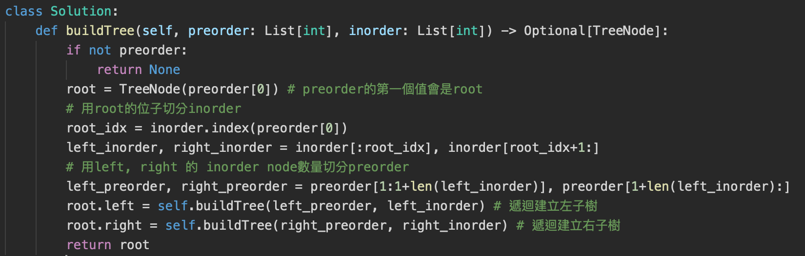

# 2 Tree
## 2.1 Tree

### 常用術語

* Tree

| 問題                                                         | 說明                                                         |
| ------------------------------------------------------------ | ------------------------------------------------------------ |
| 樹的定義是？                                                 | 一定會有root  每個node會有 0-n 個 child 不會有cycle 每個node都會相連  **edge num = node num - 1** |
| 樹跟graph的關係？                                            | 樹也是一種graph，graph不是樹                                 |
| Balance tree complete tree Full tree Perfect tree   | 任一個節點左右子樹的高的差<=1 除了最後一層以外，每一層的會被填滿，且最後一層會按左到右填滿 每一個node都有兩個子node complete 且 Full，每一層的會被填滿 |
| 祖先?後裔?LCA? layer?hight? degree? Siblings?internal node? | ancestor，自己之前直到root的node descendant，自己的子節點以及他們的子節點 (lowest common ancestor)最低共同父節點 layer: 樹有幾層，root 的 level = 0 hight: 樹高，leaf node hight = 0 degree: 樹的分支度 Siblings: 同層的其他node internal node: 不是root 跟leaf的其他node |
| Perfect BT 每層曾有幾個node? 一個高度(Height)為 3 的Full BT有幾個點？ 有5個點的complete BT 樹的高度是多少  | h指節點高，n是全部node數  |
| Complet tree 用list存方的方式？                              |  |

* Binary tree

| 問題                                       | 說明                                                         |      |
| ------------------------------------------ | ------------------------------------------------------------ | ---- |
| Binary Tree是指？                          | 每個Ｎode最多有兩個子節點                                    |      |
| Binary Tree 的遍歷類型有哪些？             | 前序 (preorder), 中序 (inorder) 和後序 (postorder) ，指遍歷二元樹 (binary tree) 時，父節點相對於左右節點的順序  |      |
| 如果要序列化判斷兩棵樹是否相等，要怎麼做？ | 使用Full Order  |      |

### 題型：

* 搜索/遍歷/序列化 ：
  * 搜索方法分類 : 
    * BFS - Use Queue
    * DFS - Recursive/For Loop(use stack)
      * InOrder, Preorder, Postorder

* 建構（反序列化）：

    * 給便利順序建構樹,  根據 Inorder 確定root，根據 Postorder/Preorder 切分左右子樹（BST不需要）

* 修改 - 增加刪除節點

### 技巧：

* 使用 Full binary tree 的結構來幫忙做：
    * serialization
    * deserialization
    
* 雙層 Recusive ：
    * 題目有類似任意節點...所有節點...
    
### 題目

#### Tree 遍歷/搜尋/序列化

* preorder, inorder, postorder, layer order 遍歷的方式

| 問題                                              | 解答                                                         |
| ------------------------------------------------- | ------------------------------------------------------------ |
| 用stack做preorder traversal?                      | 中>左>右。用stack實作，先把目前節點輸出再把左右子節點放到stack中。  |
| 用stack做inorder traversal?                       |  |
| 用stack做postorder traversal?                     | 左>右>中。將父節點和左右子節點都放進 stack 中，並將父節點的左右子節點設為 `NULL`。當 stack pop 出一個節點沒有左右子節點時，表示他的左右子節點已經被拜訪過了，則可以拜訪父節點。  |
| 用recursive做preorder/inorder/postorder traversal |  |
| Layer order?                                      | 用BFS(queue)  |

* 遍歷樹判斷是否達成某條件

* 根據左右子節點的回傳資訓判斷是否達成某條件

| 問題                          | 描述                                                         | 解法                                                       |
| ----------------------------- | ------------------------------------------------------------ | ---------------------------------------------------------- |
|94 Binary Tree Inorder Traversal|回傳一棵樹的inorder順序|1. 序列化，用BFS/Stack 2. Morris Traversal|
|98. Validate Binary Search Tree|驗證一棵樹是不是BST|遍歷tree並驗證每個點符合BST規則|
| 99. Recover Binary Search Tree                          | 給一個BST的root，這棵樹中有兩個node不符合BST的規則，請找出來並修正  | 1. 中序遍歷樹，將所有的node跟node的值分別放到list中，對node的值做排序，再將node依據排序好的值賦予新的值 2. Morris Traversal |
| 100. Same Tree                                          | 給予兩棵樹的root判斷兩棵樹是否一樣                           | 1. 同時遍歷兩顆tree，並在過程中判斷是否相同 2. 序列化兩棵樹並比較 |
| 102. Binary Tree Level Order Traversal                  | 將一顆ＢＳＴ轉為Level Order sequence                         | BFS遍歷tree，並序列化                                        |
| 104. Maximum Depth of Binary Tree                       | 求一顆樹最大深度                                             | 1. DFS遍歷tree，每個node找出其左有子節點的深度，並回傳自己的深度為max+1 2. BFS 遍歷tree，統計總層數 |
| Check Balance                                           | 確認一顆ＢＴ是否是balance                                    | 遞迴檢查每個node的左右子樹的差是否<=1，每次遞迴返回本身的高度，並判斷左右子樹回傳的高度差是否<=1 |
| 226. Invert Binary Tree                                 | 反轉一個二元樹(左子樹變右子樹)                               | DFS遍歷tree，離開node時交換左右子樹                          |
| **124. Binary Tree Maximum Path Sum**                   | 找到一顆樹中由兩個leaf node組成的path的最大值                | DFS，每個root找齊左右節點的最大值，加上自己後判斷是否要更新答案 |
| **235. Lowest Common Ancestor of a Binary Search Tree** | 給一棵BST，找出樹上兩個點的最低共同父節點LCA(lowest common ancestor) | 類似236，但不用每次都找左右兩個子樹，如果root大於p跟q則只需要找左子樹，root小魚跟q則只需要找右子樹 |
| **236. Lowest Common Ancestor of a Binary Tree**        | 給一棵BT樹，找出樹上兩個點的最低共同父節點LCA(lowest common ancestor) | DFS遍歷tree，每個node回傳自己或是自己的子節點是否有target node，每個節點根據左右子節點的回傳資訊判斷自己是否是LCA |
| **572. Subtree of Another Tree**                        | 判斷一棵樹Ｂ是否是另一棵樹Ａ的substree A subtree of a binary tree `tree` is a tree that consists of a node in `tree` and all of this node's descendants. The tree `tree` could also be considered as a subtree of itself. | 1. 遞迴對Ａ的每個Ｎode判斷由該node開始的tree是否跟Ｂ相同(Same Tree問題） 2. 序列化兩棵樹並比較是否相等  |
| :star:**Random Node**                                   | You are implementing a binary tree class from scratch which, in addition to insert, find, and delete, has a method getRandomNode() which returns a random node from the tree. All nodes should be equally likely to be chosen. Design and implement an algorithm for getRandomNode, and explain how you would implement the rest of the methods |1. 把樹轉乘inorder的形式，random回傳一個node  2. 改變樹的結構，每個node多紀錄包含自己有幾個子節點，根據random的數字判斷要走左右或是選當錢節點  |

#### construct tree

| 問題                                                         | 描述                                                         | 解法                                                         |
| ------------------------------------------------------------ | ------------------------------------------------------------ | ------------------------------------------------------------ |
| **105. Construct Binary Tree from Preorder and Inorder Traversal** | 透過preorder、inorder建立BT preorder = [3,9,20,15,7],  inorder = [9,3,15,20,7]  Output: [3,9,20,null,null,15,7] | preorder確認root，inorder確認左右子樹  |
| 297. Serialize and Deserialize Binary Tree                   | 自行設計一個方式序列化tree並可以反序列化 | 1. 使用full preorder serializer tree，在不斷的拿第一個值作為root建立tree  2. Layer serialize  |

## 2.2 Binary Search Tree :star::star::star::star::star:

| 問題                                            | 答案                                                         |
| ----------------------------------------------- | ------------------------------------------------------------ |
| BST 定義？                                      | 1. 每個Ｎode 左 < 中 < 右 因此**In-order traversal的結果會是有序的**) 2. **不存在相等的節點** |
| BST 常用操作有拿些？ 他們的avg, worst Time 是？ |  |
| BST中刪除一個Ｎode?                             | 該節點沒有左右子樹  -> 直接刪除  該節點只有右子樹     ->  刪掉節點，將右子樹替換到刪除節點的位子   該節點只有左子樹    ->  找到刪除節點左子數中的最大值的節點替換到刪除節點的位子  該節點有左右子樹    ->  找到刪除節點左子數中的最大值的節點替換到刪除節點的位子 |
| BST中插入一個新Ｎode?                           | 不斷做search直到空節點，在該位置新增節點                     |
| BST中查詢一個值？                               | DFS，如果當前node比target小代表target在右邊，當前node比target大代表target在左邊 |
| 找到ＢＳＴ中 小於/小於等於 target的最大值node   |  |
| 找到ＢＳＴ中 大於/大於等於 target的最大值node   |  |

#### BST 題目

| 題目                                    | 題目說明                                                     | 解法                                                         |
| --------------------------------------- | ------------------------------------------------------------ | ------------------------------------------------------------ |
| :star:**LeetCode 285 : Inorder Successor in BST** | 給予一個BST以及樹中的一個node找到該node的in-order traversal的successor | 1. 忽視ＢＳＴ特性，直接用中序遍歷去找target node的successor Binary Search Tree  2. 使用ＢＳＴ特性，In-order traversal會是按照排序過的順序的，找樹中大於target的node中最小的，使用recursive/stack 中 trace道的第k個值 |
| **Pramp : Largest Smaller BST Key** | 給予一個BST以及樹中的一個node找到該樹中小於target node的最大node | 找到ＢＳＴ中小於target的最大值node |
| **230. Kth Smallest Element in a BST** | 找到ＢＳＴ中第k個小的值  | 中序遍歷到第Ｋ個值 對二元搜尋樹 (binary search tree, BST) 做 inorder traversal 就是由小到大依序遍歷。 |
| **Minimal Tree** 108. Convert Sorted Array to Binary Search Tree | 給予一個排序好且元素不重複的array，設計一個方法可以建出樹高最小的BST | 已知如果要讓ＢＳＴ樹高最小，每次都拿中位數的點作為root，可以確保左右子樹有一樣數量的節點。遞迴每一次都丟中間的值去建立，並切分array為左有兩個部分再分別遞迴去建立BST  |
| **95. Unique Binary Search Trees II**                        | give a postive number n, generate all BST which has node id from 1 to n  | backtracking，每個node分別視為root，根據root切分左右序列遞回建立左右子樹，使用memory紀錄在序列i-j可能有的root list，如果該區間已經計算過則直接使用之前計算的結果  |
| :star:**BST Sequences**                                      | 給予一顆ＢＳＴ，回傳可能可以建出該樹的全部input array        |  |
| 1569. Number of Ways to Reorder Array to Get Same BST        | 給一個 nums array 代表insert node的順序，計算可以有幾種不同insert２的順序可以產生一樣的ＢＳＴ  | 第一個num會是root，後面不管順序小於root在左邊，大於root在右邊  |

## 2.3 Binary Heap / Min/Xax Heap / Priority Queue  :star::star::star:

| 問題                          | 答案                                                         |
| ----------------------------- | ------------------------------------------------------------ |
| Heap 的定義？                 | 1. 是一個**complete binary tree**                         |
| Heap 常用的地方？             | 1. priority queue的一種實作方法 2. heap sort      將一個array建成heap 不斷地將heap中的值pop出來 3. 常用於：對一個**變動的**數列找**最大/最小/第Ｋ個大or小的數** |
| 如何用python使用heap?         |  |
| Python 移除element from heap? | 1.  2. 使用另一個heap紀錄要remove2的值，如果heap top == remove heap top，則移除兩個heap的top  |

* Heap 的時間複雜度跟資料結構

|                   | **Average** case                                             | **Worst case** | 說明                                                         |
| ----------------- | ------------------------------------------------------------ | -------------- | ------------------------------------------------------------ |
| **Space**         | O(n)                                                         | O(n)           |                                                              |
| **Search**        | O(n)                                                         | O(n)           |                                                              |
| **Find-min**      | O(1)                                                         | O(1)           |                                                              |
| **Pop**           | O(log n)                                                     | O(log n)       | Pop root （down heap) 1. 將root node的值拿出來 2. 將complete tree的最後一個node放到root的位子 3. 不斷比較新的root以及其子節點，如果新root的值比子節點大則交換兩個node的位子（如果比兩個子節點都大則跟最小的換），直到順序正確 |
| **Push**          | **O(1)**  For a random insert sequence: 1/2\*1 + 1/4 \* 2 + ... | O(log n)       | push (up-heap) 1. 將新node插入到樹的最後一個位子 2. 如果該node比其父node小則交換兩個node，直到順序正確 |
| **push then Pop** | O(log n)                                                     | O(log n)       | 會比先 Insert 在 Pop 還要快 1. 比較新增的node以及現有的root哪個表較小，將比較小的作為新的root  2. 對新的root做down heap |
| **Heapify**       | O(n)                                                         | *O*(*n*)       | 1. 由**最後**一個節點開始檢查每一個節點是否符合規則，不符合則調整順序(down heap)，[時間複雜度](https://www.growingwiththeweb.com/data-structures/binary-heap/build-heap-proof/)  |

### Heap 題目：

| 題目                                             | 描述                                                         | 解法                                                         |
| ------------------------------------------------ | ------------------------------------------------------------ | ------------------------------------------------------------ |
| **23. Merge k Sorted Lists**                     | 給予k個排序好的link list，將他們merge成一個                  | 1. 不斷把list兩兩合併 2. 使用min Heap                     |
| 239. Sliding Window Maximum                      | 給定一個組數以及窗口大小k, 返回給次窗口移動的最大值  [1,3,-1,-3,5,3,6,7], 3. ->  [3,3,5,5,6,7] | 多種做法： 1. N*k : 每次移動窗口拾取最大值  2. multiset  3. Max heap : heap中存入數值跟index，將window範圍內的數字放入heap，每次pop最大值，直到最大值idx在window中。avg Ｏ(nlogk(每次pop的時間) ) 4. Deque (monotonic queue) O(n) |
| **295. Find Median from Data Stream**            | 實作一個MedianFinder object，會持續加入新的數值並在過程中拿到當下的median | 求一個可變數列的median，同時使用min/max heap，min heap放最大的前一半的數列，max heap放剩下較小的數列，每次插入值的時候判斷新的值要放在哪一個heap中，並平衡兩個heap的長度，由兩個heap的root計算median |
| **313. Super Ugly Number**                       | 給予一個質數列表找到第n個Super Ugly Number(指其全部的prime factor都在給定的prime list中) Input: n = 12,  primes = [2,7,13,19]  Output: 32  Explanation: [1,2,4,7,8,13,14,16,19,26,28,32] is the sequence of the first 12 super ugly numbers given primes = [2,7,13,19]. |  |
| 347. Top K Frequent Elements                     | 給一個nums array找出前k個最常出現的數字，時間複雜度小於 O(n log n)  Input: nums = [1,1,1,2,2,3], k = 2 Output: [1,2] | 1. 先遍歷一次計算每個元素出現的次數在HashMap中，在把出現的次數跟元素放到list中做sort，Ｔime：Ｏ(nlogn) 2. 先遍歷一次計算每個元素出現的次數在HashMap中，在把出現的次數跟元素一起放入max heap，再由heap中pop出k個數值 Ｔime = n(HashMap) + n(heaprify) + klog(pop k ) = O(n + klogn) 3. 先遍歷一次計算每個元素出現的次數在HashMap中，之後依序把出現的次數跟元素一起放入max heap，如果max heap的數值大於k則pop，Ｔime：Ｏ(nlogk) |
| **378. Kth Smallest Element in a Sorted Matrix** | 給予一個行與列都排序好的matrix，找到第k個小的元素 Input: matrix = [[1,5,9],[10,11,13],[12,13,15]], k = 8 Output: 13 | 1. 把數值全部加入max heap中，如果heap內的值大數量於k，則pop，最後root會是答案 2. **binary search** |
| **218. The Skyline Problem**                     | 給予一組建築物的list(start, end, hight)，計算出skyline Input: buildings = [[0,2,3],[2,5,3]]  Output: [[0,3],[5,0]] |  |

## 2.4 Prefix Tree / Trie

| 問題                                                         | 答案                                         |
| ------------------------------------------------------------ | -------------------------------------------- |
| Prefix Tree用途？                                            | 用於在一串字詞中快速查找是否有出現過特定的字 |
| 給予word_list = ["abc", "ainndex"]，建立prefix tree 時間複雜度？ | O(len(word_list)*avg_word_len)               |
| 查詢時間複雜度？                                             | max(word_len)                                |

#### 題目
| 題目                                    | 題目說明                                                     | 解法                                                         |
| --------------------------------------- | ------------------------------------------------------------ | ------------------------------------------------------------ |
|208. Implement Trie (Prefix Tree)|實作prefix tree|root不包含字符，root以外的node都包含一個字符，重root開始，把走到的node連起來會是單字(每個Ｎode需要額外紀錄是否是終點) |
|211. Design Add and Search Words Data Structure| 建立一顆prefix tree，查詢時可以用.替代全部的字元  ||
|212. Word Search II|給予一個字母board,跟一串word,回傳有哪些word在board中 |將words建成prefix tree，並遍歷board將每個格子作為起點，由四個方向DFS的去找是否有符合的word，時間複查度Ｏ(4^max(word_len))|

## 2.5 BST 進階

### AVL Tree

* 目的是讓ＢＳＴ不要過度傾斜
* 對每個節點判斷是否傾斜（左子樹高與右子樹高差過1)，傾斜則對樹做旋轉

### Red Black Tree

* 目的是讓ＢＳＴ不要過度傾斜

* 最長路徑不會超過最短path的兩倍

  
