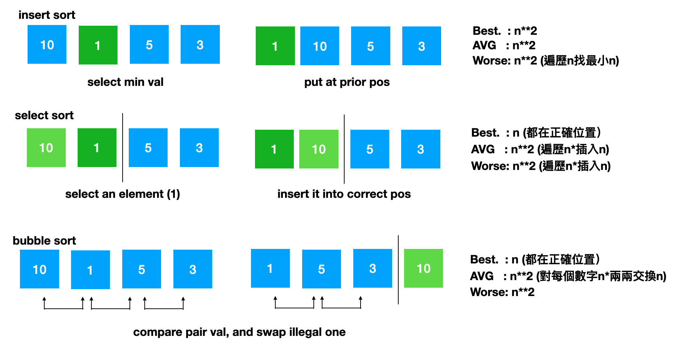
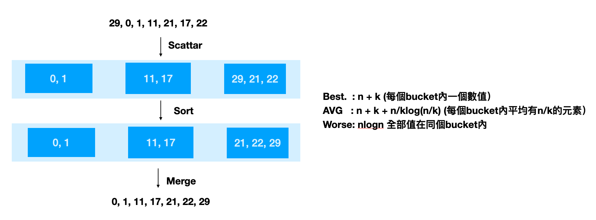
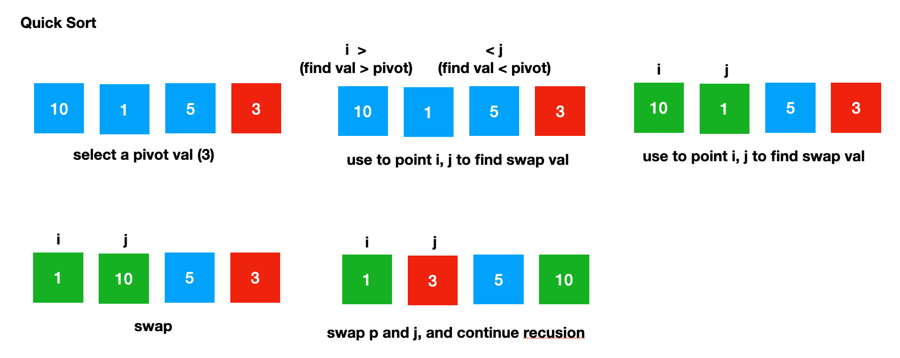
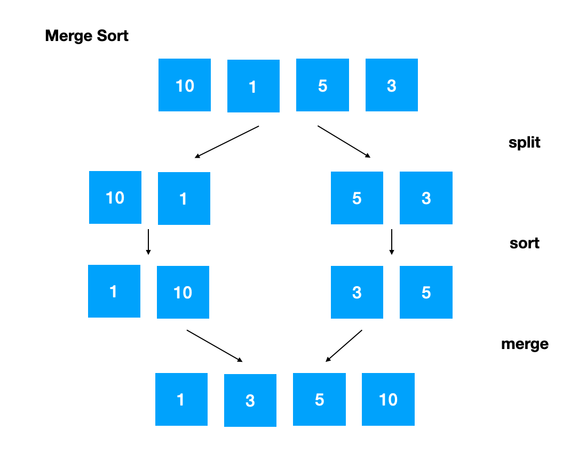

# Search

## Binary Search
* 參考資料：
    * [LeetCode Binary Search Summary 二分搜索法小結](https://www.cnblogs.com/grandyang/p/6854825.html)
* **題型:**
    * type1 - 找到目標值
    * type2 - 找到第一個比目標值 小於/大於等於、小於等於/大於 的值(目標值可能不存在)
        * 小於/大於等於
            ```
                def binary_search(self, nums: List[int], target: int) -> int:
                     left, right = 0, len(nums)-1
                     while left <= right:
                         mid = left + (right-left)//2
                         if nums[mid] < target:
                             left = mid + 1
                         else:
                             right = mid - 1
                     return right # 小於
                     # return right + 1 # 大於等於 == return left
            ```
        * 小於等於/大於
            ```
                def binary_search(self, nums: List[int], target: int) -> int:
                     left, right = 0, len(nums)-1
                     while left <= right:
                         mid = left + (right-left)//2
                         if nums[mid] <= target:
                             left = mid + 1
                         else:
                             right = mid - 1
                     return right # 小於等於
                     # return right + 1 # 大於
            ```
        * 題目：
            * 34. Find First and Last Position of Element in Sorted Array
    * type3 - 需要由其他函數來判斷移動mid point的方式
    * type4 - 特殊題
    
* **常見應用**:
    * search insert position
    * sqrt(n)
    * 在未排序的數列中找區域峰值(只要找到一個即可)
        * 162. Find Peak Element

### 題目
| Question | Describtion | Solution |
| ------------- | ---- | ------------- |
| **378. Kth Smallest Element in a Sorted Matrix** | 給予一個行與列都排序好的matrix，找到地k個小的元素<br/>Input: matrix = [[1,5,9],[10,11,13],[12,13,15]], k = 8 Output: 13 | 1. 把數值加入max heap中，如果heap內的值大數量於k，則pop，最後root會是答案<br>2. **binary search** 二分的是「答案」本身 |


# Sort

## 參考資料
* [演算法與資料結構](http://alrightchiu.github.io/SecondRound/mu-lu-yan-suan-fa-yu-zi-liao-jie-gou.html)
* [演算法筆記](http://web.ntnu.edu.tw/~algo/Sort.html)
* [Programiz Sort and Search](https://www.programiz.com/dsa/merge-sort)


## Algo Comparison

|               | Best | Average | Worst | Space | Is stable |
| ------------- | ---- | ------- | ----- | ----- | --------- |
| Select Sort   | O(n**2) | O(n**2) | O(n**2) | O(1) | False |
| Insert Sort   | O(n) | O(n**2) | O(n**2) | O(1) | True |
| **Bubble Sort**   | O(n) | O(n**2) | O(n**2) | O(1) | True |
| **Quick Sort**    | O(nlogn) | O(nlogn) | O(n**2) | O(log(N)) | False |
| **Merge Sort**    | O(nlogn) | O(nlogn) | O(nlogn) | O(N) | True |
| Heap Sort     | O(nlogn) | O(nlogn) | O(nlogn) | O(1) | False |
| Time Sort              | O(nlogn) | O(nlogn) | O(nlogn) | O(N) | True |
| Counting Sort | O(N+R) | O(N+R) | O(N+R) | O(N+R) | True |
| **Bucket/Radix Sort** | O(n+k) | O(n+k+nlogn/m) | O(nlogn) | O(nk) / O(n+k) | 看使用哪種方法來排序bucket |

### Basic Sort



### Bucket/Radix Sort

## 

### Quick Sort



### Merge Sort




## Internal vs External Sort

* Internal Sort : 把全部資料放在記憶體內
* External Sort : 資料過大無法億次排序完
  * 取部分資料進記憶體中
  * 將記憶體中的資料進行排序，把結果輸出至檔案
  * 進行合併的處理，對每份文件讀取前面的一部分，並開始合併（heap sort，當某一個文件的資料都排序完時要在讀入新資料），合併完先輸儲暫存的合併結果，重複動作直到合併完成

## 題目

### LeetCode
| Question | Describtion | Solution |
| ------------- | ---- | ------------- |
|148. Sort List | 排序一個linking list，時間複雜度Ｏ(nlogn)、空間複查度Ｏ(1) | merge sort, linking list |
| **378. Kth Smallest Element in a Sorted Matrix** | 給予一個行與列都排序好的matrix，找到地k個小的元素<br/>Input: matrix = [[1,5,9],[10,11,13],[12,13,15]], k = 8 Output: 13 | 1. 把數值加入max heap中，如果heap內的值大數量於k，則pop，最後root會是答案<br>2. **binary search** 二分的是「答案」本身 |


# Cracking the Interview
| Question | Describtion | Solution |
| ------------- | ---- | ------------- |
| 88. Merge Sorted Array | You are given two sorted arrays, A and B, where A has a large enough buffer at the end to hold B. Write a method to merge B into A in sorted order. | Start form the end |
| 49. Group Anagrams | Given an array of strings, group anagrams together. <br>input {god, dog, abc, cab, man}<br/>output {abc, cab, dog, god, man} | Sort str and use dict |
| **33. Search in Rotated Sorted Array** | Search in Rotated Array: Given a sorted array of n integers that has been rotated an unknown number of times, write code to find an element in the array. You may assume that the array was originally sorted in increasing order, | 1. 判斷左右兩邊哪邊是有序的 <br/> 2. 判斷值是否再有序的那辦裡，決定要留哪部分 |
| **Infinite Numbers Sorted Search** | Find position of an element in a sorted array of infinite numbers, You are given an array-like data structure Listy which lacks a size method. It does, however, have an elementAt ( i ) method that returns the element at index i in 0(1) time, if i is beyond the bounds of the data structure, it returns -1. (For this reason, the data structure only supports positive integers.) Given a L i s t y which contains sorted, positive integers, find the index at which an element X occurs. If x occurs multiple times, you may return any index. | 因為不知道list的大小，要先確定right point的位置，用elementAt確定2,4,8,16...的值如果大於 target，開始使用binary search(-1為無限大) |
| **Sparse Search** | Given a sorted array of strings that is interspersed with empty strings, write a method to find the location of a given string. <br/>ball, ["at", "", "", "", "ball", "", "practice", "" ,                     "", "quiz", "", ""]<br/>Output: 4 | Worse:  linearly search <br/> Best: Binary search, 指定point後如果是空值則去找最近有值的element |
| Sort Big File | Imagine you have a 20 GB file with one string per line. Explain how you would sort the file. | External sorting |
| Missing Int | Given an input file with four billion non-negative integers, provide an algorithm to generate an integer that is not contained in the file. Assume you have 1 GB of memory available for this task.<br/>FOLLOW UP<br/>What if you have only 10 MB of memory? Assume that ail the values are distinct and we now have no more than one billion non-negative integers. | question1 :1GB = 1024 * 1024 * 1024 *  8 bites , we can map all possible integers to a distinct bit with the available memory <br/>follow up: 10 mb = 1024 * 1024 * 8 bits，save val in diff bucket file which size < 10mb, and find miss int in each bucket file |
| **Find Duplicates** | You have an array of N numbers, where N is at most 32,000. The array may have duplicate entries and you do not know what N is. With only 4 Kilobytes of memory available, how would print all duplicate elements in the array ? <br/>Input : [1, 5, 1, 10, 12, 10]  <br/>Output : 1 10 | 我們有4kb = 4 * 1024 * 8 bits，比32000還多，可以用bit vector，每個bit代表該數字出現的次數 |
| **Sorted Matrix Search** | Given an M x N matrix in which each row and each column is sorted in ascending order, write a method to find an element. | The simple idea is to remove a row or column in each comparison until an element is found. Start searching from the top-right corner of the matrix. |
| Rank from Stream | Imagine you are reading in a stream of integers. Periodically, you wish to be able to look up the rank of a number x (the number of values less than or equal to x). Implement the data structures and algorithms to support these operations. That is, implement the method track(int x), which is called when each number of values less than or equal to x (not including x itself).<br/>Stream (in order of appearance): 5, 1, 4, 4, 5, 9, 7, 13, 3 <br/>getRankOfNumber(1) = 0 <br/>getRankOfNumber(3) = 1 <br/>getRankOfNumber(4) = 3 | 排序list並使用binary search去找小於target的nums的數量 |
| Peaks and Valleys | In an array of integers, a peak is an element which is greater than or equal or equal to the adjacent integers and a valley is an element which is less than or equal to the adjacent integers. For example, in the array {5, 8, 6, 2, 3, 4, 6}, {8, 6} are peaks and {5, 2} are valleys. Given an array of integers, sort the array into an alternating sequence of peaks and valleys. <br/> [5, 3, 1, 2, 3] -> [5, 1, 3, 2, 3] | 比較三個數並交換，只有當最右的peak比其他兩個數小時才會動到，不會打頗原本的peak valley<br> 5,3,1->5,1,3 <br/>3,2,3->3,2,3 |

