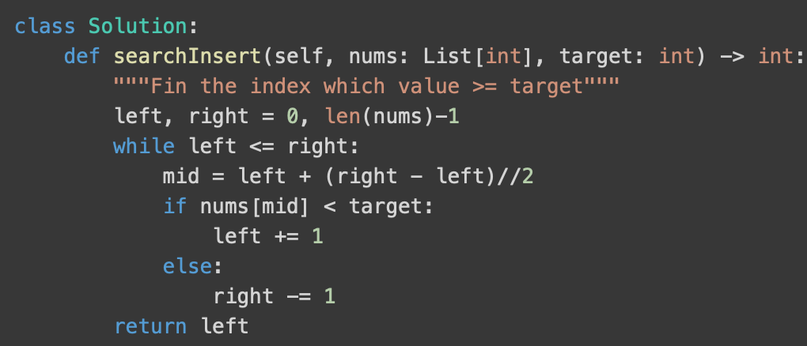
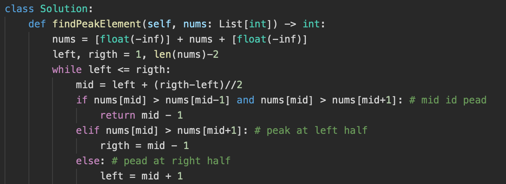
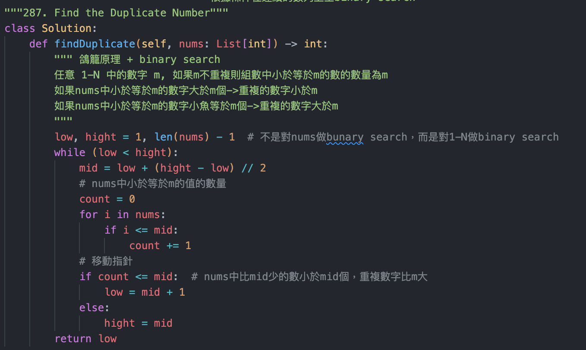
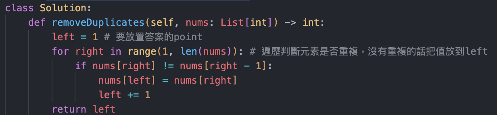
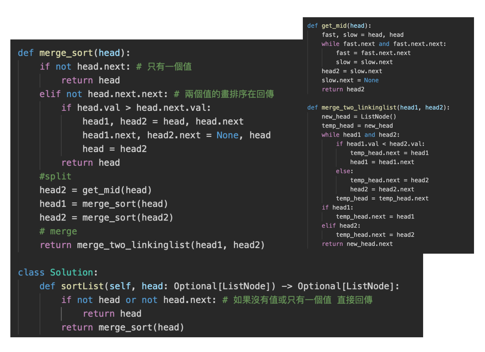

# 5.1 Search

參考資料：

* [LeetCode Binary Search Summary 二分搜索法小結](https://www.cnblogs.com/grandyang/p/6854825.html)

## Binary Search
* **題型:**

    | 類型                                                         | 說明                                                         |
    | ------------------------------------------------------------ | ------------------------------------------------------------ |
    | type1 - 找到目標值                                           |                                                              |
    | type2 - 找到第一個比目標值 小於/大於等於、小於等於/大於 的值(目標值可能不存在) |  |
    | type3 - 需要由其他函數來判斷移動mid point的方式              | 不一定是跟目標筆大小，可能是跟自己的左右元素比較ex find peak 或是找平方根時跟自己的平方比大小 |
    | type4 - 特殊題                                               | Ex 不是對陣列本身search，是search數值範圍                    |

    

### 題目

#### Type 1: 找到目標值

| Question                           | Describtion                                                  | Solution                                                     |
| ---------------------------------- | ------------------------------------------------------------ | ------------------------------------------------------------ |
| **Infinite Numbers Sorted Search** | Find position of an element in a sorted array of infinite numbers, You are given an array-like data structure Listy which lacks a size method. It does, however, have an elementAt ( i ) method that returns the element at index i in 0(1) time, if i is beyond the bounds of the data structure, it returns -1. (For this reason, the data structure only supports positive integers.) Given a L i s t y which contains sorted, positive integers, find the index at which an element X occurs. If x occurs multiple times, you may return any index. | 因為不知道list的大小，要先確定right point的位置，用elementAt確定2,4,8,16...的值如果大於 target，開始使用binary search(-1為無限大) |
| **Sparse Search**                  | Given a sorted array of strings that is interspersed with empty strings, write a method to find the location of a given string.  ball, ["at", "", "", "", "ball", "", "practice", "" ,                     "", "quiz", "", ""] Output: 4 | Worse:  linearly search   Best: Binary search, 指定point後如果是空值則去找最近有值的element |

#### Type 2: 找到第一個比目標值 小於/大於等於、小於等於/大於 的值(目標值可能不存在)

| Question                   | Describtion                                                  | Solution                                                     |
| -------------------------- | ------------------------------------------------------------ | ------------------------------------------------------------ |
| 35. Search Insert Position | Given a sorted array of distinct integers and a target value, return the index if the target is found. If not, return the index where it would be if it were inserted in order. You must write an algorithm with `O(log n)` runtime complexity. Input: nums = [1,3,5,6], target = 5  Output: 2 |  |

#### Type 3 : 需要由其他函數來判斷移動mid point的方式

| Question                                  | Describtion                                                  | Solution                                                     |
| ----------------------------------------- | ------------------------------------------------------------ | ------------------------------------------------------------ |
| **33. Search in Rotated Sorted Array**    | Search in Rotated Array: Given a sorted array of n integers that has been rotated an unknown number of times, write code to find an element in the array. You may assume that the array was originally sorted in increasing order, Input: nums = [4,5,6,7,0,1,2],  target = 0 Output: 4 Similar Question - 153. Find Minimum in Rotated Sorted Array  | 1. 判斷左右兩邊哪邊是有序的   2. 判斷target是否再有序的那1部分裡，決定要留哪部分 |
| 81. Search in Rotated Sorted Array II     | Follow to 33. The nums is a non-descending order array Input: nums = [2,5,6,0,0,1,2], target = 0 Output: true | 以[1,0,1,1,1]來說，當nums[mid]==nums[right]會影響我們判斷哪邊的序列是有序的，因此這時把最右邊的數值往左移一格，再繼續回圈判斷 |
| 153. Find Minimum in Rotated Sorted Array | Follow to 33. 在一個被rotated過的nums裡找最小值 Input: nums = [3,4,5,1,2] Output: 1 |  |
| 162 Find Peak Element                     | A peak element is an element that is strictly greater than its neighbors. Given a **0-indexed** integer array `nums`, find a peak element, and return its index. If the array contains multiple peaks, return the index to **any of the peaks**. You must write an algorithm that runs in `O(log n)` time. Input: nums = [1,2,3,1] Output: 2 | 因為有限度時間所以不能遍歷找最大值。用ＢＳ判斷如果mid大於mid＋1代表峰值在左邊，如果mid大於兩側代表找到峰值 |
| 852. Peak Index in a Mountain Array       | An array `arr` a **mountain** if the following properties hold:  Given a mountain array `arr`, return the peak index `i`. You must solve it in `O(log(arr.length))` time complexity. Input: arr = [0,10,5,2] Output: 1 | 解法跟162一樣，只是不需要頭尾padding -inf，且ＢＳ時頭尾兩個元素不可能是答案 |
| 69. Sqrt(x)                               | Given a non-negative integer `x`, return *the square root of* `x` *rounded down to the nearest integer*. The returned integer should be **non-negative** as well. Input: x = 8 Output: 2 |  |

#### Type 4 特殊題

| Question | Describtion | Solution |
| ------------- | ---- | ------------- |
|**4. Median of Two Sorted Arrays** |找两个有序数组的中位数，要求時間複雜度在log(m+n)之間 Input: nums1 = [1,2], nums2 = [3,4]  Output: 2.50000|1.merge兩個list後找中間的值，時間複雜度Ｏ(n) 2. 用兩個point指向nums1跟nums2，不斷比較最小的，找倒第k個大的值，時間複雜度Ｏ(n) 3. 中位數是第Ｋ個，分別對兩個組數找Ｋ//2個數字，比較小者代表中位數不在此，可以跟新index|
| **287. Find the Duplicate Number**               | Given an array of integers `nums` containing `n + 1` integers where each integer is in the range `[1, n]` inclusive.There is only **one repeated number** in `nums`, return *this repeated number*. You must solve the problem **without** modifying the array `nums` and uses only constant extra space. Input: nums = [1,3,4,2,2] Output: 2 | 因為不能改順序 solution 1: 鴿籠原理 + binary search O(nlogn) solution 2: Bit Manipulation：輸入數列在該bit上的1多於有序數列，代表重複的數字該bit會是1 solution 3: Bit Manipulation：用int紀錄每個數字的出現次數，把bit由1變0的代表該數字重複 solution 4: sort and find repeat (會改變nums)  |
| **378. Kth Smallest Element in a Sorted Matrix** | 給予一個行與列都排序好的matrix，找到第k個小的元素 Input: matrix = [[1,5,9],[10,11,13],[12,13,15]], k = 8 Output: 13 | 1. 把數值全部加入max heap中，如果heap內的值大數量於k，則pop，最後root會是答案 2. **binary search**  |

# 5.2 Sort

## 參考資料
* [演算法與資料結構](http://alrightchiu.github.io/SecondRound/mu-lu-yan-suan-fa-yu-zi-liao-jie-gou.html)
* [演算法筆記](http://web.ntnu.edu.tw/~algo/Sort.html)
* [Programiz Sort and Search](https://www.programiz.com/dsa/merge-sort)

## Sort Algo Comparison

|               | Best | Average | Worst | Space | Is stable |
| ------------- | ---- | ------- | ----- | ----- | --------- |
| Select Sort   | O(n**2) | O(n**2) | O(n**2) | O(1) | False |
| Insert Sort   | O(n) | O(n**2) | O(n**2) | O(1) | True |
| **Bubble Sort**   | O(n) | O(n**2) | O(n**2) | O(1) | True |
| **Quick Sort**    | O(nlogn) | O(nlogn) | O(n**2) | O(log(N)) | False |
| **Merge Sort**    | O(nlogn) | O(nlogn) | O(nlogn) | O(N) | True |
| Heap Sort     | O(nlogn) | O(nlogn) | O(nlogn) | O(1) | False |
| Time Sort              | O(nlogn) | O(nlogn) | O(nlogn) | O(N) | True |
| Counting Sort | O(N+R) | O(N+R) | O(N+R) | O(N+R) | True |
| **Bucket/Radix Sort** | O(n+k) | O(n+k+nlogn/m) | O(nlogn) | O(nk) / O(n+k) | 看使用哪種方法來排序bucket |

| 問題              | 答案                                                         |
| ----------------- | ------------------------------------------------------------ |
| Basic Sort        |  |
| Bucket/Radix Sort |  |
| Quick Sort        |  |
| Merge Sort        |  |

## Internal vs External Sort

| 問題          | 答案                                                         |
| ------------- | ------------------------------------------------------------ |
| Internal Sort | 把全部資料放在記憶體內                                       |
| External Sort | 資料過大無法一次排序完   1. 取部分資料進記憶體中  2. 將記憶體中的資料進行排序，把結果輸出至檔案  3. 進行合併的處理，對每份文件讀取前面的一部分，並開始合併（heap sort，當某一個文件的資料都排序完時要在讀入新資料，合併完先輸儲暫存的合併結果，重複動作直到合併完成 |

## python sort 套件
| Question | Describtion |
| ------------- | ---- |
|排序一個list? 是否要reverse?||
|[['c', 1], ['b', -4],  ['a', 7]] 直接sort? 根據第二個值sort?||
|[2, 1, 0, 3] 如何根據list的直對index排序||
|Given a list of non-negative integers nums, arrange them such that they form the largest number and return it. Since the result may be very large, so you need to return a string instead of an integer. Input: nums = [3,30,34,5,9]  Output: "9534330"||
|對物件做排序|The sort routines are guaranteed to use __lt__() when making comparisons between two object python object 比較的fintion: |

## 題目

| Question | Describtion | Solution |
| ------------- | ---- | ------------- |
| 26. Remove Duplicates from Sorted Array | Given an integer array `nums` sorted in **non-decreasing order**, remove the duplicates [**in-place**](https://en.wikipedia.org/wiki/In-place_algorithm) such that each unique element appears only **once**. The **relative order** of the elements should be kept the **same**. Input: nums = [0,0,1,1,1,2,2,3,3,4]  Output: 5, nums = [0,1,2,3,4,_,_,_,_,_] | 1. 遍歷第一次把重複的數字換成_，在用two point，遍歷元素閉一個point指向_的空位，第二個point去找後面的數字，找到後交換兩個point 2. 使用兩個point，left point指向要放置的位子，right point遍歷陣列找到沒有重複的元素放到left |
| 88. Merge Sorted Array                  | You are given two sorted arrays, A and B, where A has a large enough buffer at the end to hold B. Write a method to merge B into A in sorted order. 相似題 21. Merge Two Sorted Lists - Merge two sorted linked lists 23. Merge k Sorted Lists - Merge k sorted linked lists (heap) | 1. 把Ａ的數值移到最尾端，用兩個point指向ＡＢ序列的開頭，用一個point c指向現在答案要放的位子，判斷比較小的值放到point c 2. 直接由numsA的尾端開始把ＡＢ中最大的數直插入 |
| 148. Sort List                          | 排序一個linking list，時間複雜度Ｏ(nlogn)、空間複查度Ｏ(1)   | merge sort, linking list |
| Sort Big File                           | Imagine you have a 20 GB file with one string per line. Explain how you would sort the file. | External sorting                                             |
| Missing Int                             | Given an input file with four billion non-negative integers, provide an algorithm to generate an integer that is not contained in the file. Assume you have 1 GB of memory available for this task. FOLLOW UP What if you have only 10 MB of memory? Assume that ail the values are distinct and we now have no more than one billion non-negative integers. | question1 :1GB = 1024 * 1024 * 1024 *  8 bites , we can map all possible integers to a distinct bit with the available memory  follow up: 10 mb = 1024 * 1024 * 8 bits，save val in diff bucket file which size < 10mb, and find miss int in each bucket file |
| **Find Duplicates**                     | You have an array of N numbers, where N is at most 32,000. The array may have duplicate entries and you do not know what N is. With only 4 Kilobytes of memory available, how would print all duplicate elements in the array ?  Input : [1, 5, 1, 10, 12, 10]   Output : 1 10 | 1. 我們有4kb = 4 * 1024 * 8 bits，比32000還多，可以用bit vector，每個bit代表該數字出現的次數 |
| Rank from Stream                        | Imagine you are reading in a stream of integers. Periodically, you wish to be able to look up the rank of a number x (the number of values less than or equal to x). Implement the data structures and algorithms to support these operations. That is, implement the method track(int x), which is called when each number of values less than or equal to x (not including x itself). Stream (in order of appearance): 5, 1, 4, 4, 5, 9, 7, 13, 3  getRankOfNumber(1) = 0  getRankOfNumber(3) = 1  getRankOfNumber(4) = 3 | 1. 每次有新元素時排序list並使用binary search去找小於target的nums的數量 2. 使用BST |
| Peaks and Valleys                       | In an array of integers, a peak is an element which is greater than or equal or equal to the adjacent integers and a valley is an element which is less than or equal to the adjacent integers. For example, in the array {5, 8, 6, 2, 3, 4, 6}, {8, 6} are peaks and {5, 2} are valleys. Given an array of integers, sort the array into an alternating sequence of peaks and valleys.   [5, 3, 1, 2, 3] -> [5, 1, 3, 2, 3] | 比較三個數並交換，只有當最右的peak比其他兩個數小時才會動到，不會打頗原本的peak valley  5,3,1->5,1,3  3,2,3->3,2,3 |
| 49. Group Anagrams                      | Given an array of strings, group anagrams together.  input {god, dog, abc, cab, man} output {abc, cab, dog, god, man} | 使用一個hash紀錄 排序過的字串：對應的element index，ex, abc: [0, 2]，之後再根據hash中的value回傳 |

