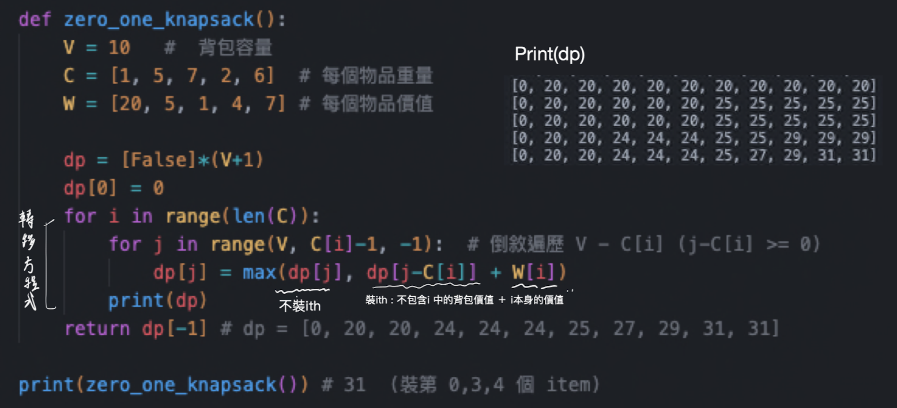
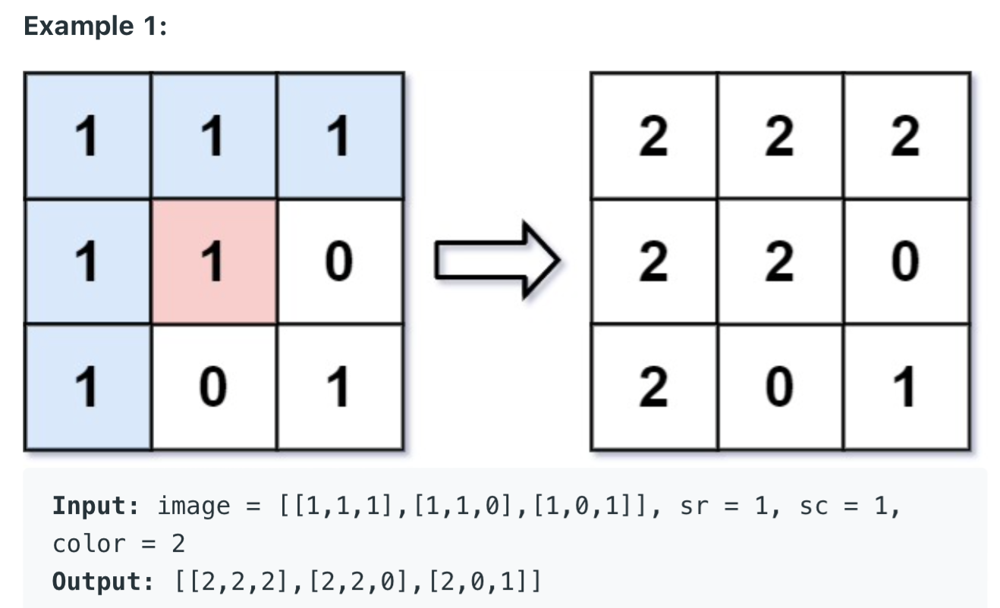

# Dynamic Programming

* [DP Pattern](https://leetcode.com/discuss/general-discussion/458695/dynamic-programming-patterns)
* DP 本身和 memory + recursive 十分相似，只是遍歷值的方法不同
* DP
    * 特性 :
        * 可以將一個問題分成子問題，當子問題有最佳解時，組合起來也會是最佳解
    * 步驟 :
        * 定義dp函式
        * 轉移方程式
        * 確定初始化方式

## 題目類型

### 背包問題 (knapsack problem)

* [背包問題九講](http://www2.lssh.tp.edu.tw/~hlf/class-1/lang-c/DP.pdf)

| 問題                                                         | 答案                                                         |
| ------------------------------------------------------------ | ------------------------------------------------------------ |
| 0/1 背包問題的定義？                                         | 有Ｎ物品放入容量為Ｖ的背包，物品i重量c[i]、價值w[i]，求將哪些物品放入可以有最大的價值 |
| 轉移方程式 與 sudocode?                                      |  |
| 包包不需裝滿？                                               | 用 0 初始化 （遍歷時可以由任意一個狀態開始裝東西） ＃程式demo |
| 包包需裝滿？                                                 | 用 負無限 初始化 （遍歷時只能由有裝到東西的開始初始化） ＃程式demo |
| 每種物品有無限個？ 完全背包問題 (unbounded knapsack problem) | 正序遍歷 C[i] - V                                            |
| 每種物品有n[i]件？                                           | 多一個回圈判斷曲 0 - n[i] 個的直哪個最大                     |
| 時間複雜度？                                                 | O(VN)                                                        |

#### 題目

| 題目                                                         | 說明                                                         | 解法                                                         |
| ------------------------------------------------------------ | ------------------------------------------------------------ | ------------------------------------------------------------ |
| Ｃracking the interview 8.11 Coins [518. Coin Change 2](https://leetcode.com/problems/coin-change-2/) [322. Coin Change](https://leetcode.com/problems/coin-change/) (to find the fewest coins to make the change) [39. Combination Sum](https://leetcode.com/problems/combination-sum/) (to print out the actual combinations) | Given an infinite number of quarters (25 cents), dimes (10 cents), nickels (5 cents), and pennies (1 cent), write code to calculate the number of ways of representing n cents. | 只找找最佳解：背包問題，可以重複放 找全部的組合：Ｒecursive |
| 416. Partition Equal Subset Sum                              | Given a **non-empty** array `nums` containing **only positive integers**, find if the array can be partitioned into two subsets such that the sum of elements in both subsets is equal. Input: nums = [1,5,11,5]  Output: true  Explanation: The array can be partitioned as [1, 5, 5] and [11]. | 背包問題，求是否可以裝到nums裡數值和的一半                   |
| 494. Target Sum                                              | You are given an integer array `nums` and an integer `target`. You want to build an **expression** out of nums by adding one of the symbols `'+'` and `'-'` before each integer in nums and then concatenate all the integers. Return the number of different **expressions** that you can build, which evaluates to `target`. Input: nums = [1,1, 1], target = 3  Output:  3  Explanation:  -1+1+1  /  1-1+1. / 1+1-1 | 01 package  A(加上加號的數字): pos set, B(加上減號的數字): neg set sum = A + B, target = A - B A = (sum + target)/2 題目等於求 由 nums中選出一些數 和為 (sum + target)/2, 有幾種組合方法 |

### Range DP

* dp\[i\] - 代表一個區間(ex 0-i)內的數值
* dp\[i\]\[j\] - 代表區間i-j內的數值
* 常見題目
  * 計算編輯距離、字串間有關聯性等等

### 題目

| 題目                                               | 說明                                                         | 解法                           |
| :------------------------------------------------- | ------------------------------------------------------------ | ------------------------------ |
| 10. Regular Expression Matching                    | Given an input string (`s`) and a pattern (`p`), implement regular expression matching with support for `'.'` and `'*'`.  '.' Matches any single character. '\*' Matches zero or more of the preceding element. s = "ab" p = ".*" Output: true | 二維Dp代表s[i]跟s[j]是否有配對 |
| 44. Wildcard Matching                              | Given an input string (`s`) and a pattern (`p`), implement wildcard pattern matching with support for `'?'` and `'*'`. '?' Matches any single character.  '\*' Matches any sequence of characters (including the empty sequence). s = "adceb" p = "*a*b" Output: true | 二維Dp代表s[i]跟s[j]是否有配對 |
| 139. Word Break                                    | Given a string `s` and a dictionary of strings `wordDict`, return `true` if `s` can be segmented into a space-separated sequence of one or more dictionary words. Input: s = "leetcode", wordDict = ["leet","code"] Output: true | DP / BFS / DFS                 |
| 279. Perfect Squares                               | Given a positive integer *n*, find the least number of perfect square numbers (for example, `1, 4, 9, 16, ...`) which sum to *n*. 12 = 4 + 4 + 4.  and 13 = 4 + 9. |                                |
| 309. Best Time to Buy and Sell Stock with Cooldown | You are given an array `prices` where `prices[i]` is the price of a given stock on the `ith` day.Find the maximum profit you can achieve. You may complete as many transactions as you like (i.e., buy one and sell one share of the stock multiple times) with the following restrictions: After you sell your stock, you cannot buy stock on the next day (i.e., cooldown one day). 相似題1 只能選一天買一天賣  相似題2 可以選多天買賣(同一天可以買跟賣 or 同一天不能買跟賣) |                                |

## Cracking the interview

| Question                                                     | Description                                                  | Solution                                                     |
| ------------------------------------------------------------ | ------------------------------------------------------------ | ------------------------------------------------------------ |
| 8.1 Triple Step                                              | A child is running up a staircase with n steps and can hop either 1 step, 2 steps, or 3 steps at a time. Implement a method to count how many possible ways the child can run up the stairs. | DFS/DP                                                       |
| 8.2 Robot in a Grid                                          | Imagine a robot sitting on the upper left corner of grid with r rows and c columns. The robot can only move in two directions, right and down, but certain cells are "off limits" such that the robot cannot step on them. Design an algorithm to find a path for the robot from the top left to the bottom right. | DFS + Memory/BFS                                             |
| 8.3 Magic Index                                              | A magic index in an array A[ 0••• n -1] is defined to be an index such that A[ i] = i. Given a sorted array of distinct integers, write a method to find a magic index, if one exists, in array A. | Binary Search                                                |
| 8.4 Power Set(看解說)                                        | Write a method to return all subsets of a set.               | DFS                                                          |
| 8.5 Recursive Multiply(看解說)                               | Write a recursive function to multiply two positive integers without using the *operator.You can use addition, subtraction, and bit shifting, but you should minimize the number of those operations. | DFS + Memory                                                 |
| [**8.6 Towers of Hanoi**](https://blog.csdn.net/sjt19910311/article/details/52331761) | In the classic problem of the Towers of Hanoi, you have 3 towers and N disks of different sizes which can slide onto any tower. The puzzle starts with disks sorted in ascending order of size from top to bottom (i.e., each disk sits on top of an even larger one).You have the following constraints: (1) Only one disk can be moved at a time. (2) A disk is slid off the top of one tower onto another tower. (3) A disk cannot be placed on top of a smaller disk. Write a program to move the disks from the first tower to the last using stacks. | DP, Base Case and Build, button up                           |
| 8.7 Permutations without Dups 46. Permutations            | Write a method to compute all permutations of a string of unique characters. input: "acb" [a,c,b], [a,b,c], [c,a,b], [c,b,a], [b,a,c], [b,c, a] | Recursive 找全部的可能                                       |
| 8.8 Permutations with Dups [47. Permutations II](https://leetcode.com/problems/permutations-ii/) | Write a method to compute all permutations of a string whose charac­ ters are not necessarily unique. The list of permutations should not have duplicates. | Recursive 找全部的可能，用set暫存結果                        |
| 8.9 Parens [22. Generate Parentheses](https://leetcode.com/problems/generate-parentheses/) | Implement an algorithm to print all valid (e.g., properly opened and closed) combinations of n pairs of parentheses. Input: n = 3  Output: ["((()))","(()())","(())()","()(())","()()()"] 相似題 ：驗證輸入的括號是否正確 | recursive + stack                                            |
| 8.10 Paint Fill [733. Flood Fill](https://leetcode.com/problems/flood-fill/) | 給予一個board，以及一個point(sr, sc)以及指定的顏色數字，把該point相臨的相同顏色的區域都改成新的顏色<be> | Bfs/dfs找board中相鄰的區域                                   |
| 8.12 Eight Queens [51. N-Queens](https://leetcode.com/problems/n-queens/) | Write an algorithm to print all ways of arranging eight queens on an 8x8 chess board so that none of them share the same row, column, or diagonal. In this case, "diagonal" means all diagonals, not just the two that bisect the board. | Recursive 用一維陣列紀錄皇后的位子，並 如果兩點的xy座標的差的絕對值相等，代表兩點在同一個對角線上 |
| 8.13 Stack of Boxes 300. Longest Increasing Subsequence   | Stack of Boxes: You have a stack of n boxes, with widths wi, heights hi, and depths di. The boxes cannot be rotated and can only be stacked on top of one another if each box in the stack is strictly larger than the box above it in width, height, and depth. Implement a method to compute the height of the tallest possible stack. The height of a stack is the sum of the heights of each box. | LIS - Longest Increasing Subsequence O(NlogL)，N是序列長度，L是LIS長度 |
| 8.14 Boolean Evaluation                                      | Given a boolean expression consisting of the symbols 0 (false), 1 (true), & (AND), I (OR), and /\ (XOR), and a desired boolean result value result, implement a function to count the number of ways of parenthesizing the expression such that it evaluates to result. EXAMPLE countEval("l /\01011", false) -> 2  countEval("0&0&0&1/\ll0", true) -> 10 相似題： | Range DP  [Solution](https://www.geeksforgeeks.org/boolean-parenthesization-problem-dp-37/) |

