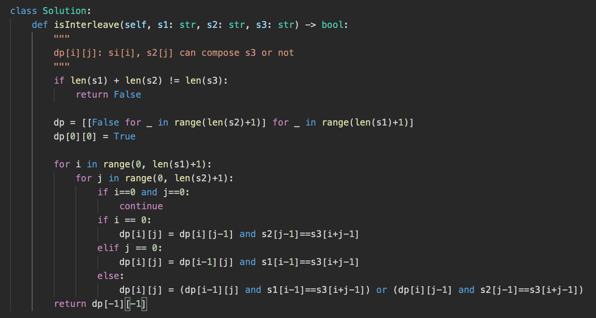

# Dynamic Programming

* [DP Pattern](https://leetcode.com/discuss/general-discussion/458695/dynamic-programming-patterns)
* DP 本身和 memory + recursive 十分相似，只是遍歷值的方法不同
* DP
    * 特性 :
        * 可以將一個問題分成子問題，當子問題有最佳解時，組合起來也會是最佳解
    * 步驟 :
        * 定義dp函式
        * 轉移方程式
        * 確定初始化方式

# 6.1 題目類型

## 6.1.1  Best Solution - Minimum (Maximum) Path to Reach a Target

* 題目特色 ： 給予一個target去找最小/大的cost/path/sum，或是該目標是否可以達成

* 題目解法 ： 過去需要考慮組合的最優解＋加上當前這一步的cost

  ```
         routes[i] = min(routes[i-1], routes[i-2], ... , routes[i-k]) + cost[i]
  ```

| 題目                                                         | 說明                                                         | 解法                                                         |
| ------------------------------------------------------------ | ------------------------------------------------------------ | ------------------------------------------------------------ |
| [746. Min Cost Climbing Stairs](https://leetcode.com/problems/min-cost-climbing-stairs/) | You are given an integer array `cost` where `cost[i]` is the cost of `ith` step on a staircase. Once you pay the cost, you can either climb one or two steps.<br>You can either start from the step with index `0`, or the step with index `1`.<br/>Return *the minimum cost to reach the top of the floor*.<br>Input: cost = [10,15,20]  Output: 15  (由index1出發 爬兩層) | Button  UP<br><br>top down<br> |
| **139. Word Break**                                          | Given a string `s` and a dictionary of strings `wordDict`, return `true` if `s` can be segmented into a space-separated sequence of one or more dictionary words.<br>Input: s = "leetcode", wordDict = ["leet","code"] Output: true | 1. Recursive: O(2^N)<br>2. Recursive + Memory<br>3. DP<br> |
| 140. Word Break II                                           | 同139 但需要回傳全部的結果<br>Input: s = "catsanddog", wordDict = ["cat","cats","and","sand","dog"] Output: ["cats and dog","cat sand dog"] | 1. Recursive: <br/><br>2. Recursive + Memory<br/> |


### 6.1.1.1 背包問題 (knapsack problem)

* [背包問題九講](http://www2.lssh.tp.edu.tw/~hlf/class-1/lang-c/DP.pdf)

  ​    

| 問題                                                         | 答案                                                         |
| ------------------------------------------------------------ | ------------------------------------------------------------ |
| 0/1 背包問題的定義？                                         | 有Ｎ物品放入容量為Ｖ的背包，物品i重量c[i]、價值w[i]，求將哪些物品放入可以有最大的價值<br>V = 10   #  背包容量<br> C = [1, 5, 7, 2, 6]  # 每個物品重量<br>W = [20, 5, 1, 4, 7] # 每個物品價值 |
| 轉移方程式 與 sudocode?                                      |  |
| 包包不需裝滿？                                               | 用 0 初始化 （遍歷時可以由任意一個狀態開始裝東西）           |
| 包包需裝滿？                                                 | 用 負無限 初始化 （遍歷時只能由有裝到東西的開始初始化）      |
| 每種物品有無限個？<br>完全背包問題 (unbounded knapsack problem) | 正序遍歷 C[i] - V                                            |
| 每種物品有n[i]件？                                           | 多一個回圈判斷曲 0 - n[i] 個的直哪個最大                     |
| 時間複雜度？                                                 | O(VN)                                                        |


#### 背包問題題目

| 題目                                                         | 說明                                                         | 解法                                                         |
| ------------------------------------------------------------ | ------------------------------------------------------------ | ------------------------------------------------------------ |
| Ｃracking the interview 8.11 Coins<br>[322. Coin Change](https://leetcode.com/problems/coin-change/) (to find the fewest coins to make the change)<br/>[518. Coin Change 2](https://leetcode.com/problems/coin-change-2/)<br>[39. Combination Sum](https://leetcode.com/problems/combination-sum/) (to print out the actual combinations) | 給予一組硬幣跟目標 ex, amount = 5, coins = [1,2,5]，求：<br>1. 用最少的硬幣數目組到target<br>2. 組到target有幾種組合<br>3. 列出可以組成target的全部組合 | 1. 背包問題，可以重複放<br>2. [Distinct way，因為物品可以重複裝，但重複的cost只算1，因此注意初始化跟轉譯方程式](https://leetcode.com/problems/coin-change/submissions/628901849/)<br>3. [Recursive](https://leetcode.com/problems/combination-sum/submissions/875943766/) |
| 416. Partition Equal Subset Sum                              | Given a **non-empty** array `nums` containing **only positive integers**, find if the array can be partitioned into two subsets such that the sum of elements in both subsets is equal.<br>Input: nums = [1,5,11,5] <br>Output: true <br>Explanation: The array can be partitioned as [1, 5, 5] and [11]. | 背包問題，求是否可以裝到nums裡數值和的一半                   |
| 279. Perfect Squares                                         | Given a positive integer *n*, find the least number of perfect square numbers (for example, `1, 4, 9, 16, ...`) which sum to *n*.<br>12 = 4 + 4 + 4.  and 13 = 4 + 9. | 轉換為背包問題，Target 是 n，1～n's max sqrt是value，每個的cost是1 |
| **494. Target Sum**                                          | You are given an integer array `nums` and an integer `target`.<br>You want to build an **expression** out of nums by adding one of the symbols `'+'` and `'-'` before each integer in nums and then concatenate all the integers.<br>Return the number of different **expressions** that you can build, which evaluates to `target`.<br>Input: nums = [1,1, 1], target = 1 <br/>Output:  3 <br/>Explanation:  -1+1+1  /  1-1+1. / 1+1-1 | 01 package<br> A(加上加號的數字): pos set, B(加上減號的數字): neg set<br>sum = A + B, target = A - B<br>A = (sum + target)/2<br>題目等於求 由 nums中選出一些數 和為 (sum + target)/2, 有幾種組合方法 |
| 474. Ones and Zeroes                                         | You are given an array of binary strings `strs` and two integers `m` and `n`.Return *the size of the largest subset of `strs` such that there are **at most*** `m` `0`*'s and* `n` `1`*'s in the subset*.<br>Input: strs = ["10","0","1"], m = 1, n = 1 <br>Output: 2 |  |


## 6.1.2 Distinct Way

* 題目特色 ： 給予一個目標，要求找到到達該目標有幾種不同的方式

* 題目解法 ： 將到達目前狀態的全部方法加起來

  ```
  routes[i] = routes[i-1] + routes[i-2], ... , + routes[i-k]l
  ```

| 題目                | 說明                                                         | 解法                                                         |
| ------------------- | ------------------------------------------------------------ | ------------------------------------------------------------ |
| 70. Climbing Stairs | You are climbing a staircase. It takes `n` steps to reach the top.<br>Each time you can either climb `1` or `2` steps. In how many distinct ways can you climb to the top? |  |


## 6.1.3 Merging Intervals

* 題目特色：給予一組資料，考慮連續的區間找到最佳的解法

* 題目解法：找到每個區間的最佳解

  ```
       // from i to j
       dp[i][j] = dp[i][k] + result[k] + dp[k+1][j]
       
       # top-down
       for (int k = i; k <= j; ++k) {
      	result = max(result, topDown(nums, i, k-1) + result[k] + topDown(nums, k+1, j));
       }
       return memo[/*state parameters*/] = result;
       
       # button-up
       for(int l = 1; l<n; l++) {
         for(int i = 0; i<n-l; i++) {
             int j = i+l;
             for(int k = i; k<j; k++) {
                 dp[i][j] = max(dp[i][j], dp[i][k] + result[k] + dp[k+1][j]);
             }
         }
      }
  ```


**interval best**

| 題目                                                         | 說明                                                         | 解法                                                         |
| :----------------------------------------------------------- | ------------------------------------------------------------ | ------------------------------------------------------------ |
| 1130. Minimum Cost Tree From Leaf Values                     | 給予一個bunary tree 的leaf in-order 數值的 array，該tree的node都會是其全部leaf中最大兩數的乘積，求非leaf nodel最小的合是多少。<br>Input: arr = [6,2,4] <br>Output: 32 | 讓dp紀錄每個區間的最小值，每次更新時算出左右兩個最大leaf的乘積，加上之前區間的最小值<br> |
| [Burst Balloons](https://leetcode.com/problems/burst-balloons/) | 給予一排帶有數字的氣球，每次打破一個氣球可以獲得相鄰氣球相乘的份數，最高可以得幾分？<br>nums = [3,1,5,8] --> [3,5,8] --> [3,8] --> [8] --> [] <br>coins =  3\*1\*5    +   3\*5\*8   +  1\*3\*8  + 1\*8\*1 = 167 |  |
| **546. Remove Boxes**                                        | 每次可以選一個數字，由數列中移除相連的部分，該數字連續有k個的話可以獲得k*k score，最高可以得幾分 | 因為如果讓原本不相連的數字，透過先打破其他氣球，讓其相連的話會獲得更高的分數，因此不能只用二維ＤＰ[i][j]只紀錄 i-j 範圍內最高的直，使用3維 DP[i][j][l] 紀錄在i-j位子內 有l筆跟i位子數字一樣的氣球還未消除 |
| 8.14 Boolean Evaluation                                      | Given a boolean expression consisting of the symbols 0 (false), 1 (true), & (AND), I (OR), and /\ (XOR), and a desired boolean result value result, implement a function to count the number of ways of parenthesizing the expression such that it evaluates to result.<br/>EXAMPLE<br/>countEval("l /\01011", false) -> 2 <br/>countEval("0&0&0&1/\ll0", true) -> 10<br> | [Solution](https://www.geeksforgeeks.org/boolean-parenthesization-problem-dp-37/) |


## 6.1.4 **DP on Strings**

* 題目特色：給予兩組字串s1跟s2，計算某種結果

* 題目解法：找到每個區間的最佳解

  ```
  比較兩個字串 ：
  // i - indexing string s1
  // j - indexing string s2
  for (int i = 1; i <= n; ++i) {
     for (int j = 1; j <= m; ++j) {
         if (s1[i-1] == s2[j-1]) {
             dp[i][j] = /*code*/;
         } else {
             dp[i][j] = /*code*/;
         }
     }
  }
  
  比較單一字串
  for (int l = 1; l < n; ++l) {
     for (int i = 0; i < n-l; ++i) {
         int j = i + l;
         if (s[i] == s[j]) {
             dp[i][j] = /*code*/;
         } else {
             dp[i][j] = /*code*/;
         }
     }
  }
  
  ```

  

| 題目                                                         | 說明                                                         | 解法                                                         |
| :----------------------------------------------------------- | ------------------------------------------------------------ | ------------------------------------------------------------ |
| 10. Regular Expression Matching                              | Given an input string (`s`) and a pattern (`p`), implement regular expression matching with support for `'.'` and `'*'`. <br>'.' Matches any single character.<br>'\*' Matches zero or more of the preceding element.<br>s = "ab" p = ".*" Output: true | 1. Recursive<br>2.二維Dp代表s[i]跟s[j]是否有配對 |
| 44. Wildcard Matching                                        | Given an input string (`s`) and a pattern (`p`), implement wildcard pattern matching with support for `'?'` and `'*'`.<br>'?' Matches any single character. <br>'\*' Matches any sequence of characters (including the empty sequence).<br>s = "adceb" p = "*a*b" Output: true | 1. Recursive<br>2. 二維Dp代表s[i]跟s[j]是否有配對            |
| [647. Palindromic Substrings](https://leetcode.com/problems/palindromic-substrings/) `Medium` | Given a string `s`, return *the number of **palindromic substrings** in it*.<br>Input: s = "aaa" <br>Output: 6 <br>Explanation: Six palindromic strings: "a", "a", "a", "aa", "aa", "aaa". |  |
| [1143. Longest Common Subsequence](https://leetcode.com/problems/longest-common-subsequence/) `Medium` | Given two strings `text1` and `text2`, return *the length of their longest **common subsequence**.* If there is no **common subsequence**, return `0`.<br>Input: text1 = "abcde", text2 = "ace"  Output: 3   Explanation: The longest common subsequence is "ace" and its length is 3. |  |
| 97. Interleaving String                                      | Given strings `s1`, `s2`, and `s3`, find whether `s3` is formed by an **interleaving** of `s1` and `s2`.<br>Input: s1 = "aabcc", s2 = "dbbca", s3 = "aadbbbaccc" Output: false |  |
| 72. Edit Distance                                            | Given two strings `word1` and `word2`, return *the minimum number of operations required to convert `word1` to `word2`*.You have the following three operations permitted on a word:<br>Insert、Remove、Replace | [解法](https://www.geeksforgeeks.org/edit-distance-dp-5/)，先確保len(word1) = n， Len(word2)＝m，n>=m <br>1. Recursive. Time(3^m), Space(m) <br>2. DP <br><br>3. DP with efficient space<br> |


## 6.1.5 Decision Making

* 題目特色：給予一組數值，找到 根據當下情況選可能的選則 或是 忽略當下的選折 已找到最佳解

* 題目解法：選擇當下要做行動或是跳過

  ```
      // i - indexing a set of values
      // j - options to ignore j values
      for (int i = 1; i < n; ++i) {
         for (int j = 1; j <= k; ++j) {
             dp[i][j] = max({dp[i][j], dp[i-1][j] + arr[i], dp[i-1][j-1]});
             dp[i][j-1] = max({dp[i][j-1], dp[i-1][j-1] + arr[i], arr[i]});
         }
      }
  ```

  

| 題目                                                         | 說明                                                         |                                                              |
| :----------------------------------------------------------- | ------------------------------------------------------------ | ------------------------------------------------------------ |
| [198. House Robber](https://leetcode.com/problems/house-robber/) | 一個小偷給予一個每個房子的價值的陣列，不能連續偷兩間房子，求最大的金額<br>Input: nums = [1,2,3,1] <br>Output: 4 <br>Explanation: Rob house 1 (money = 1) and then rob house 3 (money = 3). |  |
| House Robber cycle                                           | 同上題，但是房子是一個圓，不同同使搶第一家跟最後一家         | 分別去掉第一家跟最後一家求兩次答案                           |


| 題目                                                         | 說明                                                         |                                                              |
| :----------------------------------------------------------- | ------------------------------------------------------------ | ------------------------------------------------------------ |
| [121. Best Time to Buy and Sell Stock](https://leetcode.com/problems/best-time-to-buy-and-sell-stock/) `Easy` | 知道每天個股票價格，選一天買另一天賣，最高的獲利是？<br>Input: prices = [7,1,5,3,6,4] Output: 5 | 遍歷一次prices，每次紀錄當下的最小值，用目前的price去看獲利<br> |
| [714. Best Time to Buy and Sell Stock with Transaction Fee](https://leetcode.com/problems/best-time-to-buy-and-sell-stock-with-transaction-fee/) `Medium` | 知道每天個股票價格，可以選多天買賣，但是同時只能持有一張股票，並且每次交易需要支付手續費<br>Input: prices = [1,3,7,5,10,3], fee = 3 Output: 6 | 在沒有交易費用的情況下，只要買低賣高就可以，但因為有手續費的影響，因此不一定有利潤就賣出會是最高的獲利，要用ＤＰ<br> |
| [309. Best Time to Buy and Sell Stock with Cooldown](https://leetcode.com/problems/best-time-to-buy-and-sell-stock-with-cooldown/) `Medium` | 知道每天個股票價格，可以選多天買賣，但是在賣了股票後不能夠再隔天立刻買<br>Input: prices = [1,2,3,0,2] Output: 3 |  |
| [123. Best Time to Buy and Sell Stock III](https://leetcode.com/problems/best-time-to-buy-and-sell-stock-iii/) `Hard` | 知道每天個股票價格，可以選多天買賣，但是同時只能持有一張股票，最多只能買兩次 |  |
| [188. Best Time to Buy and Sell Stock IV](https://leetcode.com/problems/best-time-to-buy-and-sell-stock-iv/) `Hard` | 知道每天個股票價格，可以選多天買賣，但是同時只能持有一張股票，最多只能買Ｋ次 |  |


## 6.1.6 Other

* Longest Increasing Subsequence (LIS)

  | Question                                                     | Description                                                  | Solution                                                     |
  | ------------------------------------------------------------ | ------------------------------------------------------------ | ------------------------------------------------------------ |
  | 300. Longest Increasing Subsequence                          | 給一數列求LIS的最大長度是多少                                |  |
  |                                                              | 給一數列求一個最長的LIS序列                                  |  |
  | Box Stacking Problem                                         | You are given a set of n types of rectangular 3-D boxes, where the i^th box has height h(i), width w(i) and depth d(i) (all real numbers). You want to create a stack of boxes which is as tall as possible, but you can only stack a box on top of another box if the dimensions of the 2-D base of the lower box are each strictly larger than those of the 2-D base of the higher box. Of course, you can rotate a box so that any side functions as its base. It is also allowable to use multiple instances of the same type of box. | O(n*2) |
  | 8.13 Stack of Boxes<br>1691. Maximum Height by Stacking Cuboids | Stack of Boxes: You have a stack of n boxes, with widths wi, heights hi, and depths di. The boxes cannot be rotated and can only be stacked on top of one another if each box in the stack is strictly larger than the box above it in width, height, and depth. Implement a method to compute the height of the tallest possible stack. The height of a stack is the sum of the heights of each box. | 類似上題但不需要旋轉箱子且比較的方式改為使用 當 h,w,d都小於時才判斷比較小 |
  |                                                              | 有一堆封裝完畢的紙箱，把紙箱一個一個疊起來存放。然而每個紙箱都有不同的重量、不同的抗壓力量。如果一個紙箱上方的總重量，超過這個紙箱的抗壓力量，這個紙箱就會被壓傷，這是我們不樂見的。請問最多能疊多少個紙箱？又有多少種避免壓傷紙箱的疊法？ | 類似於單機排程<br>依照承重能力由小到大排序。 根據重量依序疊紙箱，由上往下疊，求出LIS。<br/>依照抗壓力量由大到小排序。 依序疊紙箱，由下往上疊，求出LIS。 |
  |                                                              |                                                              |                                                              |


## Cracking the interview

| Question                                                     | Description                                                  | Solution                                                     |
| ------------------------------------------------------------ | ------------------------------------------------------------ | ------------------------------------------------------------ |
| 8.1 Triple Step                                              | A child is running up a staircase with n steps and can hop either 1 step, 2 steps, or 3 steps at a time. Implement a method to count how many possible ways the child can run up the stairs. | DFS/DP                                                       |
| 8.2 Robot in a Grid                                          | Imagine a robot sitting on the upper left corner of grid with r rows and c columns. The robot can only move in two directions, right and down, but certain cells are "off limits" such that the robot cannot step on them. Design an algorithm to find a path for the robot from the top left to the bottom right. | DFS + Memory/BFS                                             |
| 8.3 Magic Index                                              | A magic index in an array A[ 0••• n -1] is defined to be an index such that A[ i] = i. Given a sorted array of distinct integers, write a method to find a magic index, if one exists, in array A. | Binary Search                                                |
| 8.4 Power Set(看解說)                                        | Write a method to return all subsets of a set.               | DFS                                                          |
| 8.5 Recursive Multiply(看解說)                               | Write a recursive function to multiply two positive integers without using the *operator.You can use addition, subtraction, and bit shifting, but you should minimize the number of those operations. | DFS + Memory                                                 |
| [**8.6 Towers of Hanoi**](https://blog.csdn.net/sjt19910311/article/details/52331761) | In the classic problem of the Towers of Hanoi, you have 3 towers and N disks of different sizes which can slide onto any tower. The puzzle starts with disks sorted in ascending order of size from top to bottom (i.e., each disk sits on top of an even larger one).You have the following constraints:<br/>(1) Only one disk can be moved at a time.<br/>(2) A disk is slid off the top of one tower onto another tower.<br/>(3) A disk cannot be placed on top of a smaller disk.<br/>Write a program to move the disks from the first tower to the last using stacks. | DP, Base Case and Build, button up                           |
| 8.7 Permutations without Dups<br>46. Permutations            | Write a method to compute all permutations of a string of unique characters.<br>input: "acb"<br>[a,c,b], [a,b,c], [c,a,b], [c,b,a], [b,a,c], [b,c, a] | Recursive 找全部的可能                                       |
| 8.8 Permutations with Dups<br>[47. Permutations II](https://leetcode.com/problems/permutations-ii/) | Write a method to compute all permutations of a string whose charac­ ters are not necessarily unique. The list of permutations should not have duplicates. | Recursive 找全部的可能，過程中紀錄已經找過的index，不要每次都重頭遍歷 |
| 8.9 Parens<br>[22. Generate Parentheses](https://leetcode.com/problems/generate-parentheses/) | Implement an algorithm to print all valid (e.g., properly opened and closed) combinations of n pairs of parentheses.<br>Input: n = 3 <br>Output: ["((()))","(()())","(())()","()(())","()()()"]<br/>相似題 ：驗證輸入的括號是否正確 | recursive + stack                                            |
| 8.10 Paint Fill<br>[733. Flood Fill](https://leetcode.com/problems/flood-fill/) | 給予一個board，以及一個point(sr, sc)以及指定的顏色數字，把該point相臨的相同顏色的區域都改成新的顏色<be> | Bfs/dfs找board中相鄰的區域                                   |
| 8.12 Eight Queens<br>[51. N-Queens](https://leetcode.com/problems/n-queens/) | Write an algorithm to print all ways of arranging eight queens on an 8x8 chess board so that none of them share the same row, column, or diagonal. In this case, "diagonal" means all diagonals, not just the two that bisect the board. | Recursive<br>用一維陣列紀錄皇后的位子，並 如果兩點的xy座標的差的絕對值相等，代表兩點在同一個對角線上 |

