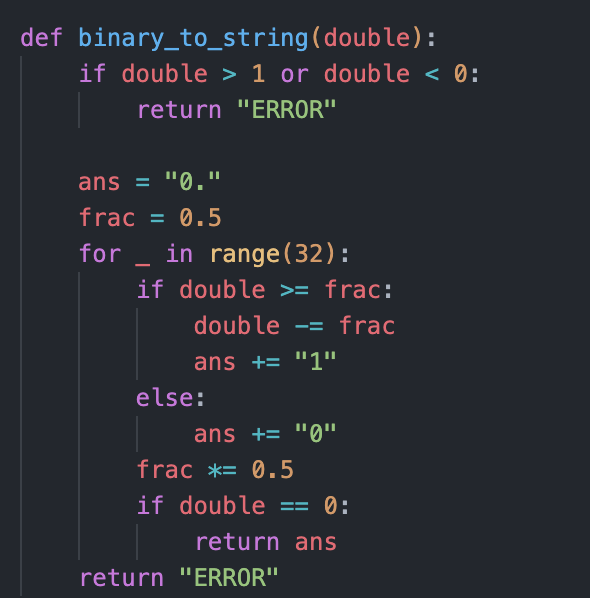
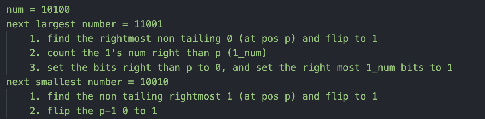

# Bit Manipulation


## 7.1 Bitwise Operator
|Operator |Name|Trick 1|Trick 2|Trick 3|Trick 4|
|:----|--------|-----|-----|-----|-----|
|&|and|x & 0s = 0|x & 1s = x|x & x = x||
| \| |or      |x \| 0s = x|x \| 1s = 1s|x \| x =x||
|^|xor|x ^ 0s = x|x ^ 1s = ~x|x ^ x = 0|交換 x,y : X^=Y, Y^=X, X^=Y|
| ~        | Not         |             |              |           ||
| <<       | left shift  |x*2 = x << 2|               |              ||
| \>>       | right shift | x/2 = x >> 2 |              |           ||

useful mask

| Mask                     | Way                        |
| ------------------------ | -------------------------- |
| 11111?                   | -1                         |
| 1110?                    | -1 < 1                     |
| x = 110110 - x =?        | 001001 + 1 = 001010        |
| Get the rightest 1 of x? | x ^ (-x)                   |
| 111011                   | -1 ^ (1 << 2)<br>~(1 << 2) |
| 000100                   | 1 << 2                     |
| 11100                    | -1 << 2                    |
| 00011                    | (1 << 3) - 1               |


## 7.2 Negative Numbers

### Ones’ Complement

| Decemal       | one's complement |
| ------------- | ---------------- |
| 2**(n-1) - 1  | 0111             |
| +1            | 0001             |
| +0            | 0000             |
| -0            | 1111             |
| -1            | 1110             |
| -2**(n-1) - 1 | 1000             |

* 轉換方式：

  * (1) Inverse number : 3 表示為: 0011， -3 表示為: 1100
  * (2)  2**n – x – 1

* 減法 一樣可透過 加 一個『負數』來完成，但需要端回進位 (end around carry)：

  ```
  3 - 2 :
     0 0 1 1   (3)
  +  1 0 1 1   (-2)
  -----------
  1 | 0 0 0 0
            1
  -----------
      0 0 0 1
  ```

### Two’s Complement

| Decemal      | two's complement |
| ------------ | ---------------- |
| 2**(n-1) - 1 | 0111             |
| +1           | 0001             |
| 0            | 0000             |
| -1           | 1111             |
| -2**(n-1)    | 1000             |

* 1 的補數 仍具有兩個 0 (+0、-0)，加法器在做減法時，常需要一個額外的步驟，做端回進位。2 的補數 (Two’s Complement) 即可避免以上問題，整數表示、加法器的實作… 幾乎皆採用 2 的補數 表示法

*  轉換方式 ：

  * 1 的補數 + 1

  *  2***n – x (n 為位元數，x 為欲轉換正數)*

    

## 7.3 Right Shift

* 第一種：logic right shift

  * 直接補0

  ```
     -3               6
  1 1 0 1  >> 1 => 0 1 1 0
  ```

* 第二種 ： Arithmetic right shift

  * 右移但是保留sign bit的值
  * python

  ```
     -3               -2
  1 1 0 1  >> 1 => 1 1 1 0
  ```


## 7.4 Common Bit Task

* Getting, Setting, Clear(i, i_left, i_right), Update

### Get Bit

```
def get_ith_bit(num, i):
	return ((num & 1 << i) != 0)
```

### Set Bit

```
def set_ith_bit(num, i):
	return num | (1 << i)
```

### Clear Bit

```
def clear_ith_bit(num, i):
  mask = ~(1 << i)
	return num & mask

def clear_bit_left_than_ith(num, i):
  mask = (1 << i) - 1
	return num & mask
	
def clear_bit_right_than_ith(num, i):
  mask = ~(1 << (1 + i)) # or mask = -1 << (i + 1)
	return num & mask
```

### Update Bit

```
def update_ith_bit(num, i, value):
    mask = ~(1 << i)
    return (num & mask) | (value << i)
```


##  Problem


| Question                      | Description                                                  | Solution                                                     |
| ----------------------------- | ------------------------------------------------------------ | ------------------------------------------------------------ |
| Inserting                     | Given two 32-bit numbers, N and M, and two-bit positions, i and j. Write a method to insert M into N such that M starts at bit j and ends at bit i. You can assume that the bits j through i have enough space to fit all of M. Assuming index start from 0. <br>a)  N = 1024 (10000000000),     M = 19 (10011),     i = 2, j = 6      Output : 1100 (10001001100) |                                                              |
| **Binary fraction to String** | Given a real number between 0 and 1 (e.g., 0.72) that is passed in as a double, print the binary representation. If the number cannot be represented accurately in binary with at most 32 characters, print” ERROR:’ |  |
| Flip Bit to Win               | You have an integer and you can flip exactly one bit from a 0 to a 1, Write code to find the length of the longest sequence of Is you could create. |                                                              |
| **Next Number**               | Given a positive integer, print the next smallest and the next largest number that have the same number of 1 bits in their binary representation. |  |
| Debugger                      | Explain what the following code does: ( (n & ( n - 1 ) ) == 0) | n = 4    100 & 011 == 0 <br>n=3      11 & 10 == 0<br>the code is used to check if n is 2, 4, 8, 16 ... (power of two) |
| Conversion                    | Write a function to determine the number of bits you would need to flip to convert integer A to integer B. |                                                              |
| PairwiseSwap                  | Write a program to swap odd and even bits in an integer with as few instructions as possible (e.g., 23 (**0**0**0**1**0**1**1**1), it should be converted to 43 (0**0**1**0**1**0**1**1**)). |                                                              |
| Draw Line                     | A monochrome screen is stored as a single array of bytes, allowing eight consecutive pixels to be stored in one byte. The screen has width `w`, where `w` is divisible by `8` (that is, no byte will be split across rows). The height of the screen, of course, can be derived from the length of the array and the width. Implement a function that draws a horizontal line from `(x1, y)` to (x2,  y) |                                                              |


### LeetCode Problem

| Question                           | Description                                                  | Solution                                                     |
| ---------------------------------- | ------------------------------------------------------------ | ------------------------------------------------------------ |
| **268. Missing Number**            | 給一個組數 有n個不同的數字，由[0, n]間的數字構成，找出遺失的數字 ex nums = [3,0,1] => 2 | solution 1: 將少了一個數的nums跟完整的組數 xor，則相同的變為0，剩下的就是缺少的數<br>solution 2: 對組數再新增一個不服好，並把對應的數字放到相同的index中，最後符號所在的index就會是答案 |
| **287. Find the Duplicate Number** | 給予一個數列有n+1個值，每個值在1-n之間找到唯一重複的數<br/>限制 : 不可以改變輸入的組數，<br/>限制 :也只能用 constant extra space | solution 1: 鴿籠原理 + binary search <br/>solution 2: Bit Manipulation : 輸入數列在該bit上的1多於有序數列，代表重複的數字該bit會是1 |
| **371. Sum of Two Integers**       | 在不使用 + - 的情況下做兩數相加                              | 用bit做相加 ex 4(100) + 7(111) = 11(1011)  <br/>1.  不考慮進位 1 (1) ，做xor運算 <br/>2. 進位 10 (1010)，做 and運算在左移一位  <br/>3. 和剛好是1.2.兩數相加，要相加的部分在繼續重複1.2.直到2值為0  <br/>4. 負數的部分，調用 ＆ mask, 且最終的回傳值要用MAX判斷 |
|                                    |                                                              |                                                              |