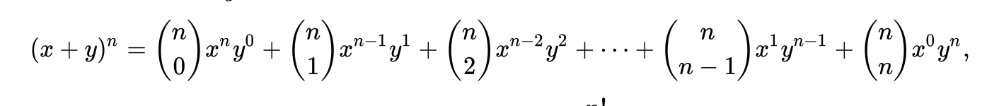
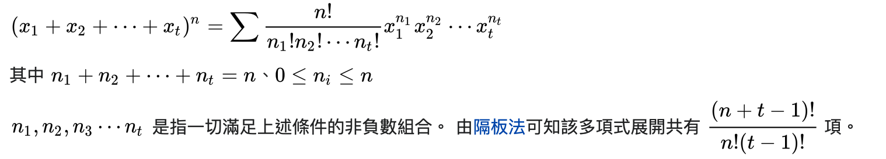
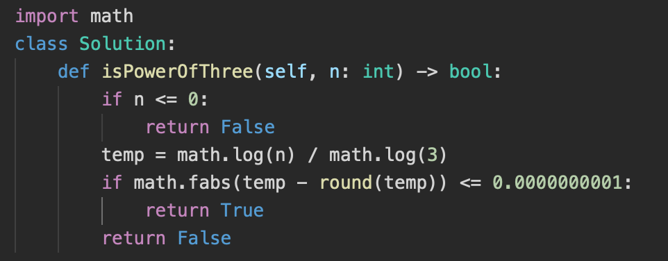
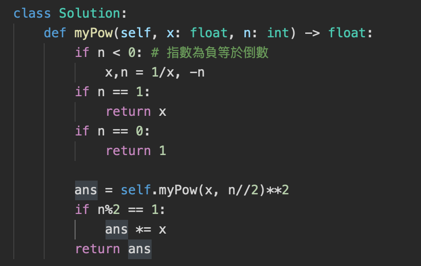
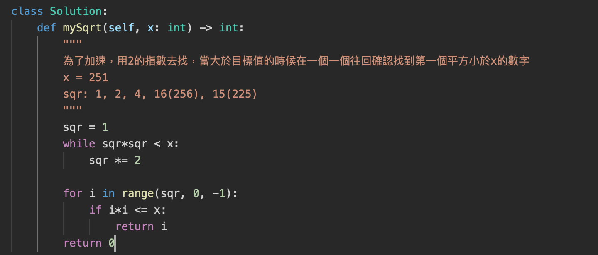
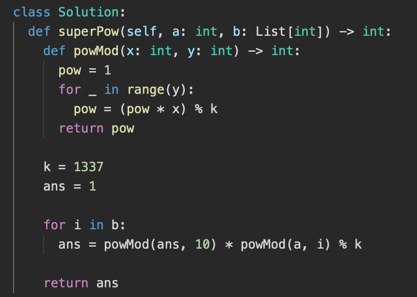
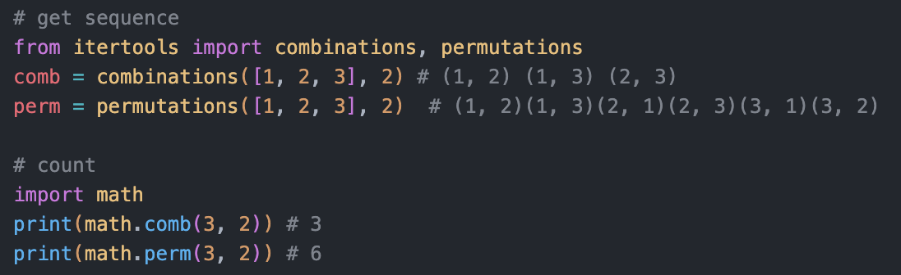

[TOC]


# 一、Math

## 1. Prime Numbers

1. 一個正整數有已有哪些被其他數字組合的特性？

   * 每一個正整數都可以由prime number相乘組合出來

     ```
     87 = 2^2 * 3^1 * 5^0 * 7*1 ....
     ```

   * 每一個正整數可以由4個以下的正整數的平方和組起來 

     ```
     13 = 9 + 4
     ```

2. 兩個數字ＸＹ的gcd跟lcm是指什麼

   * gcd : great. common divisor
   * lcm: least common multiple

3. 兩個數字ＸＹ的gcd跟lcm有哪些特性

   * Dvisibility


## 2. Probability

機率常見的公式有哪些？

* conditional probability:
    * Independent :
        * P(A) = P(A^B)/P(B)  <=>  P(A^B) = P(B)*P(A)
    * No Independent :
        * P(A|B) = P(A^B)/P(B)  <=>   P(A^B) = P(A|B)*P(B)      
    
* Joint Probability
    * P(AvB) = P(A) + p(B) - P(A^B)
    
* Mutual Exclusivity 
    * P(AvB) = P(A) + p(B)
    * P(A^B) = 0
    
* Bayes' theorem
  
    


## 3. Permutation and Combination

| 題目                                                         | 答案                                                         |
| ------------------------------------------------------------ | ------------------------------------------------------------ |
| Permutation的公式？                                          | P(n, m) = n! / (n-m)!                                        |
| Combination的公式？                                          | C(n. m) = n! / (n-m)!*m!                                     |
| Cycle Permutation的公式？                                    | cycle_p(n, m) = P(n, m)/m                                    |
| Combination with Repetition/Multicombination 的公式？<br>[十個圈圈跟兩個加號的排列數？](https://ddxu2.pixnet.net/blog/post/205885106)<br>[十個圈圈跟兩個加號排列時，加號左或右都要有圈圈](https://ddxu2.pixnet.net/blog/post/205885106) | 由n個不同類型中取m個物品，每種類型的數量大於m : <br>H(n,m) = C(n+m-1, m)<br>相當於在m個物品間放n-1個隔板區分類型，且隔板跟物品的不排列<br>q1: 在１０個空格中，選２個空格放＋號，其餘皆放Ｏ，有幾種放法？C(10,2)<br>q2: 從８個圈圈的７個縫隙中，挑兩個縫隙放入＋號，有幾種放法？ C(7,2) |


## 4. Binomial Theorem

| 題目                        | 答案                                                         |      |
| --------------------------- | ------------------------------------------------------------ | ---- |
| 二項式定理是什麼？ 公式是？ | 二項式連乘的展開式<br> |      |
| 多項式定理是什麼？ 公式是？ |  |      |


## 5. Pigeonhole principle

* k 個東西分成 n 類， 若 k > (n-1)r + 1 則有一類東西之數目大於或等於 r。

  | 題目                           | 說明                                                         | 解法                                                         |
  | ------------------------------ | ------------------------------------------------------------ | ------------------------------------------------------------ |
  | 287. Find the Duplicate Number | Give a array og intergers, has n+1 items, and each val in between 1~n, There is only on repeated number, please find out the number<br> 限制 : 不可以改變輸入的組數，也只能用 constant extra space (不可以用sort) | solution 1: 鴿籠原理 + binary search O(nlogn)<br>solution 2: Bit Manipulation<br>solution 3: fast/low point (不是常數的空間)<br>solution 4: sort and find repeat (會改變nums) |


## 6. 透過log加速

* log 常用公式

  | 題目                                                         | 說明                                                         |
  | ------------------------------------------------------------ | ------------------------------------------------------------ |
  | Log_a(b) 對數的限制？Log(0), log(-5)？                       | (1) a 稱為底數，須滿足 a > 0 且 a ̸= 1。 <br>(2) b 稱為真數，須滿足 b > 0。 |
  |  |  |

| 題目                | 說明                                                         | 解法                                                         |
| ------------------- | ------------------------------------------------------------ | ------------------------------------------------------------ |
| 326. Power of Three | Given an integer `n`, return *`true` if it is a power of three. Otherwise, return `false`*.An integer `n` is a power of three, if there exists an integer `x` such that `n == 3x`. | solution 1: 一直除與3看餘數是否為零<br>solution 2: n == 3^x 兩邊同取log，logn/logx = x(整數) |


## 點跟線

| 問題               | 答案                                                         |
| ------------------ | ------------------------------------------------------------ |
| 如何得到線段公式？ |  |
| 求多項式的解？     |  |
|                    |                                                              |

## 常用數學公式

| 問題                                                         | 答案                                                         |
| ------------------------------------------------------------ | ------------------------------------------------------------ |
| 等比級數的公式？<br>1/2 + 1/4 + ..... + 1/n =?<br>1 + 2 + 4 帶入等比級數公式？ | <br>1<br>1(1-2^3) / 1-2 = 7 |
| 2^0 + 2^1 + ... + 2^n =?                                     | 2^(n-1)                                                      |
| 行列式展開？ |  |


# 二、題目

## Prime Number

| 題目                       | 解法                                                         |
| -------------------------- | ------------------------------------------------------------ |
| 判斷 n 是否是 primality    | 確認 1 - sqrt(n) 中的值是否可以整除n，可以的話代表n不是prime |
| 找出數字Ｎ以下的prime list | 列出所有正整數。從2開始，刪掉2的倍數。找下一個未被刪掉的數字，找到3，刪掉3的倍數。找下一個未被刪掉的數字，找到5，刪掉5的倍數。如此不斷下去，就能刪掉所有合數，找到所有質數。 |


## 實作數學公式

| 題目           | 說明                                                         | 解法                                                         |
| -------------- | ------------------------------------------------------------ | ------------------------------------------------------------ |
| 50. Pow(x, n)  | Implement [pow(x, n)](http://www.cplusplus.com/reference/valarray/pow/), which calculates `x` raised to the power `n` (i.e., `x^n`). |  |
| 69. Sqrt(x)    | Given a non-negative integer `x`, return *the square root of* `x` *rounded down to the nearest integer*. The returned integer should be **non-negative** as well. |  |
| 372. Super Pow | Your task is to calculate `a^b` mod `1337` where `a` is a positive integer and `b` is an extremely large positive integer given in the form of an array.<br>Input: a = 2, b = [3] Output: 8 |  |


## Crack the interview 練習題

| 題目                       | 說明 | 解法                                                         |
| -------------------------- | ---- | ------------------------------------------------------------ |
|**The Heavy Pill**|You have 20 bottles of pills. 19 bottles have 1.0 gram pills, but one has pills of weight 1.1 grams. Given a scale that provides an exact measurement, how would you find the heavy bottle? You can only use the scale once|編號1-20的藥瓶分別拿出1-20顆藥丸，使用秤子看總和多重，看總重多多少0.1的重量可以知道是哪個藥瓶的中要不同|
|Basketball|You have a basketball hoop and someone says that you can play one of two games.<br/>Game 1: You get one shot to make the hoop.<br/>Game 2: You get three shots and you have to make two of three shots.<br/>If p is the probability of making a particular shot, for which values of p should you pick one game or the other?|https://www.geeksforgeeks.org/puzzle-basketball-shots/|
|Dominos|There is an 8x8 chessboard in which two diagonally opposite corners have been cut off. You are given 31 dominos, and a single domino can cover exactly two squares. Can you use the 31 dominos to cover the entire board? Prove your answer (by providing an example or showing why it's impossible)|https://www.geeksforgeeks.org/puzzle-25chessboard-and-dominos/|
|Ants on a Triangle|There are three ants on different vertices of a triangle. What is the probability of collision (between any two or all of them) if they start walking on the sides of the triangle? Assume that each ant randomly picks a direction, with either direction being equally likely to be chosen, and that they walk at the same speed.<br/>Similarly, find the probability of collision with n ants on an n-vertex polygon|2^n - 2 / 2^n|
|Jugs of Water|You have a five-quart jug, a three-quart jug, and an unlimited supply of water (but no measuring cups). How would you come up with exactly four quarts of water? Note that the jugs areoddlyshaped,suchthatfillingupexactly"half"ofthejugwouldbeimpossible.|https://chanjarster.github.io/post/cracking-coding-interview/6.5-jugs-of-water/|
|Blue-Eyed Island|A bunch of people are living on an island, when a visitor comes with a strange order: all blue-eyed people must leave the island as soon as possible. There will be a flight out at 8:00 pm every evening. Each person can see everyone else's eye color, but they do not know their own (nor is anyone allowed to tell them). Additionally, they do not know how many people have blue eyes, although they do know that at least one person does. How many days will it take the blue-eyed people to leave?|if has m blue eyes -> m days|
|The Apocalypse|In the new post-apocalyptic world, the world queen is desperately concerned about the birth rate. Therefore, she decrees that all families should ensure that they have one girl or else they face massive fines. If all families abide by this policy-that is, they have continue to have children until they have one girl, at which point they immediately stop-what will the gender ratio of the new generation be? (Assume that the odds of someone having a boy or a girl on any given pregnancy is equal.) Solve this out logically and then write a computer simulation of it.|1. Gender ratio : 50%, 想像把不同家庭的生育結果寫成字串，ＢＧＧＢＢＢ...，加入的下一個字元是Ｇ的機率是50%，同時考慮多個家庭時，並不會被如何停止生育的條件影響|
|**The Egg Drop Problem**|There is a building of 100 floors. If an egg drops from the Nth floor or above, it will break. If it's dropped from any floor below, it will not break. You're given two eggs. Find N, while minimizing the number of drops for the worst case.|[14](https://www.geeksforgeeks.org/puzzle-set-35-2-eggs-and-100-floors/)|
|**100 Lockers**|There are 100 closed lockers in a hallway. A man begins by opening all 100 lockers. Next, he closes every second locker. Then, on his third pass, he toggles every third locker (closes it if it is open or opens it if it is closed). This process continues for 100 passes, such that on each pass i, the man toggles every ith locker. After his 100th pass in the hallway, in which he toggles only locker #100, how many lockers are open?|[10 lockers are left open](https://www.braingle.com/brainteasers/teaser.php?op=2&id=7824&comm=0)|
|**Poison**|You have 1000 bottles of soda, and exactly one is poisoned. You have 10 test strips which can be used to detect poison. A single drop of poison will turn the test strip positive permanently. You can put any number of drops on a test strip at once and you can reuse a test strip as many times as you'd like (as long as the results are negative). However, you can only run tests once per day and it takes seven days to return a result. How would you figure out the poisoned bottle in as few days as possible?|[7](https://chanjarster.github.io/post/cracking-coding-interview/6.10-poison/)|


# 三、Ｍath in Python

| 題目                                                         | 答案                                                         |
| ------------------------------------------------------------ | ------------------------------------------------------------ |
| 取上下界                                                     | math.floor(n)/math.ceil(n)                                   |
| 返回 a,b 的最大公因數 (greatest common divisor)？<br>最大公倍數？ | math.gcd(a,b)<br>math.lcm(a,b)                               |
| 取log                                                        | math.log( x, base)<br> # 會有不精準的問題<br/> math.log(243, 3) = 4.999999<br/> |
| 平方根 (square root)                                         | math.sqrt(n)                                                 |
| 取 n 階乘                                                    | math.factoria(n)                                             |
| Combination, Permutation?                                    |  |
| 絕對值                                                       | math.abs(a)                                                  |
| 四捨五入                                                     | round(1,111, 2) = 1.11<br/><br/># 會有不精準的問題<br/># 這是因為在電腦內部，1.115 真正的值是 1.11499999999999999111<br/>round(1.115, 2) = 1.11 |
| 判斷x是否是整數？                                            |  |
| Python 負數除法:<br>-5 // 2 = <br/>-5 % 2 = <br/>5 // -2 = <br/>-5 // -2 = <br/> | python 負數的//與％是向負無限取整數，[教學](https://blog.csdn.net/sun___M/article/details/83142126)<br>-5 // 2 = -3<br/>-5 % 2 = 1<br>5 // -2 = -3<br/>-5 // -2 = 2<br/> |


## python 浮點數計算問題

### Decimal

    * 提供十進位的運算，精確度(precision)、約整(rounding)等等
    * 最好用字串建立Decimal物件
    ```
    from decimal import Decimal
    a = 1.115
    Decimal(a)
    # Decimal(a) 的值和想像中的不同
    Decimal('1.1149999999999999911182158029987476766109466552734375')
    b = 1.125
    Decimal(b)
    # Decimal(b) 的值則和想像中一樣
    Decimal('1.125')
    ```
    * quantize :
      * 將一個浮點數，依指示的有效位數進行約整(rounding，或稱捨入)
        ```
        Decimal('1.115').quantize(Decimal('.00'), ROUND_HALF_UP)
        ## 得到 Decimal('1.12')，結果與我們想像中的相同
        1.12，可以直接用 print 輸出
        
        ## 錯誤的使用方式，使用「浮點數」型態建立 Decimal
        Decimal(1.115).quantize(Decimal('.00'), ROUND_HALF_UP)
        ## 錯誤，原因與之前使用 round 函數時相同
        Decimal('1.11')
        ````


