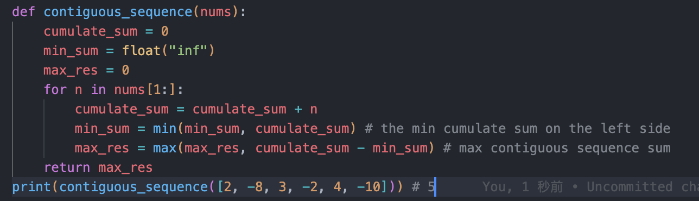

# 322. Coin Change

## Medium

| 問題                                                         | 答案                                                         |
| ------------------------------------------------------------ | ------------------------------------------------------------ |
| **16.1 Number Swapper**Write a function to swap a number in place (that is, without temporary vari­ables). |  |
| 16.2 Word Frequencies Design a method to find the frequency of occurrences of any given word in a book. What if we were running this algorithm multiple times? | 使用hash紀錄書中word出現的次數                               |
| **16.3 Intersection**Given two straight line segments (represented as a start point and an end point), compute the point of intersection, if any | 給兩點求直線公式：Cramer’s Rule求多項式的解: |
| **16.5 Factorial Zeros**： Write an algorithm which computes the number of trailing zeros in n factoria Input: n = 5 Output: 1   Factorial of 5 is 120 which has one trailing 0. | 只要有5跟2就會生成0，計算每個相乘的數字有幾個5,2的因數，且因為每個數的階乘有2的因數一定會大於5所以只需要計算有5的因數數量就可以， **n = 5:** (2 * 2 * 2 * 3 * 5) **n = 11:** (2^8 * 3^4 * 5^2 * 7). 而快速的求n!的5的因數數量的方式是 floor(n/5)  |
| 16.6 Smallest Difference: Given two arrays of integers, compute the pair of values (one value in each array) with the smallest (non-negative) difference. Return the difference | 1. 雙層回圈找差值 2. sort兩個兩個陣列並用兩個point指向兩個陣列的head，計算兩者的差並捨棄掉兩個point中較小的值往後移一部 |
| **16.7 Number Max**：Write a method that finds the maximum of two numbers. You should not use if-else or any other comparison operator |  |
| 16.8 English Int：Given any integer, print an English phrase that describes the integer (e.g., "One Thou­ sand, Two Hundred Thirty Four") |  |
| **16.9 Operations**: Write methods to implement the multiply, subtract, and divide operations for integers. The results of all of these are integers. Use only the add operator. | 1. Subtract: a + (-b)  2. Multiply: add a b times, remember neg sign 3. Divid: a - b until the ramainder is less than b |
| 16.10  Living People: Given a list of people with their birth and death years, implement a method to compute the year with the most number of people alive. You may assume that all people were born between 1900 and 2000 (inclusive). If a person was alive during any portion of that year, they should be included in that year's count. For example, Person (birth= 1908, death= 1909) is included in the counts for both 1908 and 1909. |  |
| 16.11 Diving Board: You are building a diving board by placing a bunch of planks of wood end-to-end. There are two types of planks, one of length shorter and one of length longer. You must use exactly K planks of wood. Write a method to generate all possible lengths for the diving board. |  |
| 16.12  XMLEncoding: Since XML is very verbose, you are given a way of encoding it where each tag gets mapped to a pre-defined integer value. The language/grammar is as follows: |  |
| **16.13 Bisect Squares**: Given two squares on a two-dimensional plane, find a line that would cut these two squares in half. Assume that the top and the bottom sides of the square run parallel to the x-axis. | 只要一條線過矩形(圓形)的中心，就可以把其切為兩等份，因此題目等於求兩個正方形的中心點(x1,y1), (x2, y2)，並由兩點求直線（y2-y1)X - (x2-x1)Y = y2x1 - y1x2 |
| 16.14 Best Line: Given a two-dimensional graph with points on it, find a line which passes the most number of points. | 1. 每一個點跟其他的點計算斜率，相同斜率的點代表在同一條線上，用hash紀錄相同斜率的點的數量。O(N^2)  |
| 16.15 Master Mind: The Game of Master Mind is played as follows: | 1. 先遍歷一次計算hit，並紀錄solution中沒有hit的字元在set，最後遍歷guess，找到沒有hit的判斷是否為pseudo-hit |
| **16.16 Sub Sort**: Given an array of integers, write a method to find indices `m` and `n` such that if you sorted elements `m` through `n`, the entire array would be sorted. Minimize `n - m` (that is, find the smallest such sequence). Input : 1, 2, 4, 7, 10, 11, 7, 12, 6, 7, 16, 18, 19  Output: (3, 9) | 1. Sort the array and find the idx range of value which is not equal to sorted array. O(nlogn)  2. O(n) |
| **16.17 Contiguous Sequence**: You are given an array of integers (both positive and negative). Find the contiguous sequence with the largest sum. Return the sum.EXAMPLE lnput:2, -8, 3, -2, 4, -10  Output:5 (i.e•, {3, -2, 4}) | 紀錄 cumulate sum list 以及每個位子左側最小的 cumulate sum，相減後取最大值 |
| **16.18 Pattern Matching**: You are given two strings, pattern and value.The pattern string consists of just the letters a and b, describing a pattern within a string. For example, the string catcatgocatgo matches the pattern aabab (where cat is a and go is b). It also matches patterns like a, ab, and b. Write a method to determine if value matches pattern. similar: 290. Word Pattern | backtracking |
| 16.19 Pond Sizes: You have an integer matrix representing a plot of land, where the value at that loca­tion represents the height above sea level. A value of zero indicates water. A pond is a region of water connected vertically, horizontally, or diagonally. The size of the pond is the total number of connected water cells. Write a method to compute the sizes of all ponds in the matrix.  | BFS 找相連的0的數量，注意對角線也算相連                      |
| 16.20 T9: On old cell phones, users typed on a numeric keypad and the phone would provide a list of words that matched these numbers. Each digit mapped to a set of 0 - 4 letters. Implement an algo­rithm to return a list of matching words, given a sequence of digits. You are provided a list of valid words (provided in whatever data structure you'd like). The mapping is shown in the diagram below: | 將給予的valid words建立成trie方便查詢，接著用dfs找全部可能的結果 |
| 16.21 Sum Swap: Given two arrays of integers, find a pair of values (one value from each array) that you can swap to give the two arrays the same sum Input: {4, 1, 2, 1, 1, 2} and {3, 6, 3, 3} Output: {1, 3} | (Swap1 - Swap2)*2 = sum(array1) - sum(array2) then diff = (sum(array1) - sum(array2) ) / 2 then swap2 = swap1 - diff 把array2的直放到dict中，並判斷array中的每個值減去diff是否有在dict中 |
| 16.22 Langton's Ant: An ant is sitting on an infinite grid of white and black squares. It initially faces right. At each step, it does the following: (1) At a white square, flip the color of the square, turn 90 degrees right (clockwise), and move forward one unit. (2) At a black square, flip the color of the square, turn 90 degrees left (counter-clockwise), and move forward one unit. Write a program to simulate the first K moves that the ant makes and print the final board as a grid. Note that you are not provided with the data structure to represent the grid. This is something you must design yourself. The only input to your method is K. You should print the final grid and return nothing.Themethodsignaturemightbesomethinglikevoid printKMoves(int K). |                                                              |
| **Rand7 from Rands**: Implement a method rand7() given rand5(). That is, given a method that generates a random number between 0 and 4 (inclusive), write a method that generates a random number between 0 and 6 (inclusive)  相似題： **470. Implement Rand10() Using Rand7()** |  |
| 16.24 Pairs with Sum: Design an algorithm to find all pairs of integers within an array which sum to a specified value. |  |

### random

| 問題            | 答案                                                         |
| --------------- | ------------------------------------------------------------ |
| 修改random seed | random.seed (*a=None*, *version=2*)                          |
| 整數random      | random.randint(a, b) get a random int r, a <= r **<=b**   |
| 浮點數random？  | random.random() - random a float from 0.0 to 1.0 random.uniform(a,b) - random a float num r, a <= r **<= b** |
| 抽樣？          | random.choice(*seq*) - 抽一個值 random.choices(*population*, *weights=None*, *, *cum_weights=None*, *k=1*) - 重複抽樣 random.sample(*population*, *k*, *, *counts=None*) - 不重複抽樣 |
| 隨機排序？      | random.shuffle(x) - Shuffle the sequence *x* **in place**    |

## Hard

| 問題                                                         | 答案                                                         |
| ------------------------------------------------------------ | ------------------------------------------------------------ |
| **17.2 Shuffle**: Write a method to shuffle a deck of cards. It must be a perfect shuffle-in other words, each of the 52! permutations of the deck has to be equally likely. Assume that you are given a random number generator which is perfect. | Knuth shuffle Iter array and random excahnge each element with the random chosen element from (i, end)  |
| **17.3 Random Set**: Write a method to randomly generate a set of m integers from an array of size n. Each element must have equal probability of being chosen. | Reservoir sample |
| Python random function?                                      |  |
| **17.5  Letters and Numbers**: Given an array filled with letters and numbers, find the longest subarray with an equal number of letters and numbers. 525. Contiguous Array : Given a binary array `nums`, return *the maximum length of a contiguous subarray with an equal number of* `0` *and* `1`. | 1. O(n^2): 先求出accumulative sum，紀錄每個index的num跟char的數量，在用雙層回圈找出兩者數量相等的subarray 2.  O(n): 計算每個位子的num跟chat的差距算出來，並判斷之前是否有出現過一樣的差距，如果有的話代表中間這段的num跟char的數量相等，才會抵銷讓其有一樣的差 |
| **17.6 Count of 2s**: Write a method to count the number of 2s that appear in all the numbers between 0 and n (inclusive). Input: 25 Output: 9 (2, 12, 20, 21, 22, 23, 24 and 25. Note that 22 counts for two 2s.) Similar: 233. Number of Digit One | 1. Iter the array and sum the 2 in each element 2. count 2 by each digit  |
| 17.7 Baby Names: Given two lists, one of names/frequencies and the other of pairs of equivalent names, write an algorithm to print a new list of the true frequency of each name. Note that if John and Jon are synonyms,and Jon and Johnny are synonyms, then John and Johnny are synonyms.(It is both transitive and symmetric.) In the final list, any name can be used as the "real" name. EXAMPLE Input: Names: John(15),Jon(12), Chris(13),Kris(4),Christopher(19) Synonyms:(Jon,John),(John,Johnny),(Chris,Kris),(Chris, Christopher) Output: John(27), Kris(36) | 把同意的名稱建成無向圖，之後同一個graph的數量和              |
| 17.8 Circus Tower: A circus is designing a tower routine consisting of people standing atop one anoth­ er's shoulders. For practical and aesthetic reasons,each person must be both shorter and lighter than the person below him or her. Given the heights and weights of each person in the circus,write a method to compute the largest possible number of people in such a tower. EXAMPLE lnput(ht,wt): (65, 100) (70, 150) (56, 90) (75, 190) (60, 95) (68, 110) Output: The longest tower is length 6 and includes from top to bottom: (56, 90) (60,95) (65,100) (68,110) (70,150) (75,190) | 1. Sort array by h + w, then we can get a roughly sequence.   2. use dp, dp[1] means the max people from array 0 - array i and contain i, and dp[i] = max(dp[0:i-1] if the i people can assign at the end) + 1 |
| 17.9 Kth Multiple: Design an algorithm to find the kth number such that the only prime factors are 3, 5, and 7. Note that 3, 5, and 7 do not have to be factors,but it should not have any other prime factors. For example,the first several multiples would be(in order) 1,3,5,7,9,15, 21. | heap = [1], every time when I pop a val i from heap, put i\*3, i\*5, i\*7 in the heap, and put i to the res.  |
| **17.10 Majority Element**: A majority element is an element that makes up more than half of the items in an array. Given a positive integers array, find the majority element. If there is no majority element, return-1. Do this inO(N) time and 0(1) space. Input: 1 2 5 9 5 9 5 5 5  Output: 5 | 1. 統計每個bit出現的次數，如果該bit出現的數量多於一半，代表major value該bit是1, Time O(n*bit of integer), Space O(1) 2. 使用hash, Time O(n), Space O(n) 3. Two loop, Time O(n^2), Space O(1) 4. 把數值見到ＢＳＴ中，並計算node的數量，如果大於一半則找到major value Time O(nlogn), Space O(n) 5. [Moore’s Voting Algorithm](https://www.geeksforgeeks.org/boyer-moore-majority-voting-algorithm/) 因為有一半以上的數字相同，所以至少會有2個major value相鄰，因此每次選一個數做為candidate，並計算出現的數量，如果出現的數量小於0則替換candicate，最後再檢查一次candicate是否是答案 |
| 17.11 WordDistance: You have a large text file containing words. Given any two words, find the shortest distance(in terms of number of words) between them in the file. If the operation will be repeated many times for the same file(but different pairs of words), can you optimize your solution? | 把text裡的word紀錄到hash中(word:index)，當給予單詞時找出他們出現的全部index計算距離 |
| **17.12 BiNode**: Given the `root` of a binary tree, flatten the tree into a "linked list":   The "linked list" should use the same `TreeNode`class where the `right` child pointer points to the next node in the list and the `left` child pointer is always `null`. 1. The "linked list" should be in the same order as a [**pre-order** **traversal**](https://en.wikipedia.org/wiki/Tree_traversal#Pre-order,_NLR) of the binary tree. 2. The "linked list" should be in the same order as a [**in-order** **traversal**](https://en.wikipedia.org/wiki/Tree_traversal#Pre-order,_NLR) of the binary tree.  similar: 426. Convert Binary Search Tree to Sorted Doubly Linked List | 將 double linklist的 BT 序列化，包含中序跟前序遍歷    |
| 17.13 Re-Space: Oh, no! You have accidentally removed all spaces, punctuation, and capitalization in a lengthy document. A sentence like "I reset the computer. It still didn't boot!" became "iresetthecomputeritstilldidntboot''. You'll deal with the punctuation and capi­ talization later; right now you need to re-insert the spaces. Most of the words are in a dictionary but a few are not. Given a dictionary (a list of strings) and the document (a string), design an algorithm to unconcatenate the document in a way that minimizes the number of unrecognized characters. EXAMPLE: Input: jesslookedjustliketimherbrother Output: jess looked just like tim her brother (7 unrecognized characters) |  |
| 17.15 Longest Word: Given a list of words, write a program to find the longest word made of other words in the list lnput:cat, banana, dog, nana, walk, walker, dogwalker  Output: dogwalker [472. Concatenated Words](https://leetcode.com/problems/concatenated-words/) | 類似word break 1. 把字串根據長度排序，依序由最長的字判斷其是否由其他字組成 2. 使用dp(word break)判斷是否字是由其他字組成，dp[i]代表 word[0:i] 是否是由其他字組成 |
| 17.16 The Masseuse: A popular masseuse receives a sequence of back-to-back appointment requests and is debating which ones to accept. She needs a 15-minute break between appointments and therefore she cannot accept any adjacent requests. Given a sequence of back-to-back appoint­ ment requests (all multiples of 15 minutes, none overlap, and none can be moved), find the optimal (highest total booked minutes) set the masseuse can honor. Return the number of minutes. EXAMPLE Input: {30, 15, 60, 75, 45, 15, 15, 45} Output:180 minutes ({30, 60, 45, 45}). [198. House Robber](https://leetcode.com/problems/house-robber/) | Dp[i] : 在input[0:i]的最大值 Dp[i] = max(Dp[i-2] +  Dp[i],  Dp[i-1]) |
| 17.17 Multi Search: Given a string band an array of smaller strings T, design a method to search b for each small string in T Ｔ= "mississippi" smalls = ["is","ppi","hi","sis","i","ssippi"]  output： [[1,4],[8],[],[3],[1,4,7,10],[5]] | 1. iterate T and record each char which is the start index of word 2. insert smalls into trie, and iterate T check if each char can find word in trie |
| 17.18 Shortest Supersequence: You are given two arrays, one shorter (with all distinct elements) and one longer. Find the shortest subarray in the longer array that contains all the elements in the shorter array. The items can appear in any order. EXAMPLE lnput:{1,5, 9} I {7,5, 9,0, 2,1,3,5, 7, 9.1,1,5, 8, 8, 9, 7} Output: [7, 10] (the underlined portion above) Similar: [727. Minimum Window Subsequence](https://leetcode.com/problems/minimum-window-subsequence/) | Two point: 1.  count_hash: Count the number of occurrences of each element 2.  Count: Count the number of element not in tow point 3. Use two pointer: first pointer i point the end of the substring, second pointer j point the start.  if Count >= 0 move i right, else move j right. if count==0 record the min Len of substring |
| **17.23. Max Black Square  Similar**:  [221. Maximal Square](https://leetcode.com/problems/maximal-square/) Given an `m x n` binary `matrix` filled with `0`'s and `1`'s, *find the largest square containing only* `1`'s *and return its area*.  | 1. Brue Force 2. Cumulateive Sum 3. Cumulateive Sum + DP |
| 17.24 Max Submatrix: Given an NxN matrix of positive and negative integers, write code to find the submatrix with the largest possible sum. Input:  [[-1,0],                [0,-1]]    Output: [0,1,0,1] | 1. BFS 直接暴力解，將每個grid當成左上角，爆收全部可能的submatrix，並紀錄最大值O(n^6) 2. 結合accumulate sum，指定左上跟右下的point，求每一個可能的submatrix的值O(N*N^2) , N element num in matrix  |
| **17.25 WordRectangle**: Given a list of millions of words, design an algorithm to create the largest possible rectangle of letters such that every row forms a word (reading left to right) and every column forms a word (reading top to bottom). The words need not be chosen consecutively from the list but all rows must be the same length and all columns must be the same height. Input: ["this", "real", "hard", "trh", "hea", "iar", "sld"]  Output: ["this",   "real",   "hard"] | 1. Build trie, and record the layer and height of each node 2. Fine the word w which can creat the biggest rectangle 3. Search rectangle in trie by w |
| **17.26 Sparse Similarity**: The similarity of two documents (each with distinct words) is defined to be the size of the intersection divided by the size of the union. For example, if the documents consist of integers, the similarity of {1, 5, 3} and {1, 7, 2, 3} is 0. 4, because the intersection has size 2 and the union has size 5. We have a long list of documents (with distinct values and each with an associated ID) where the similarity is believed to be "sparse" That is, any two arbitrarily selected documents are very likely to have similarity 0. Design an algorithm that returns a list of pairs of document IDs and the associated similarity. Print only the pairs with similarity greater than 0. Empty documents should not be printed at all. For simplicity, you may assume each document is represented as an array of distinct integers.   |  |

